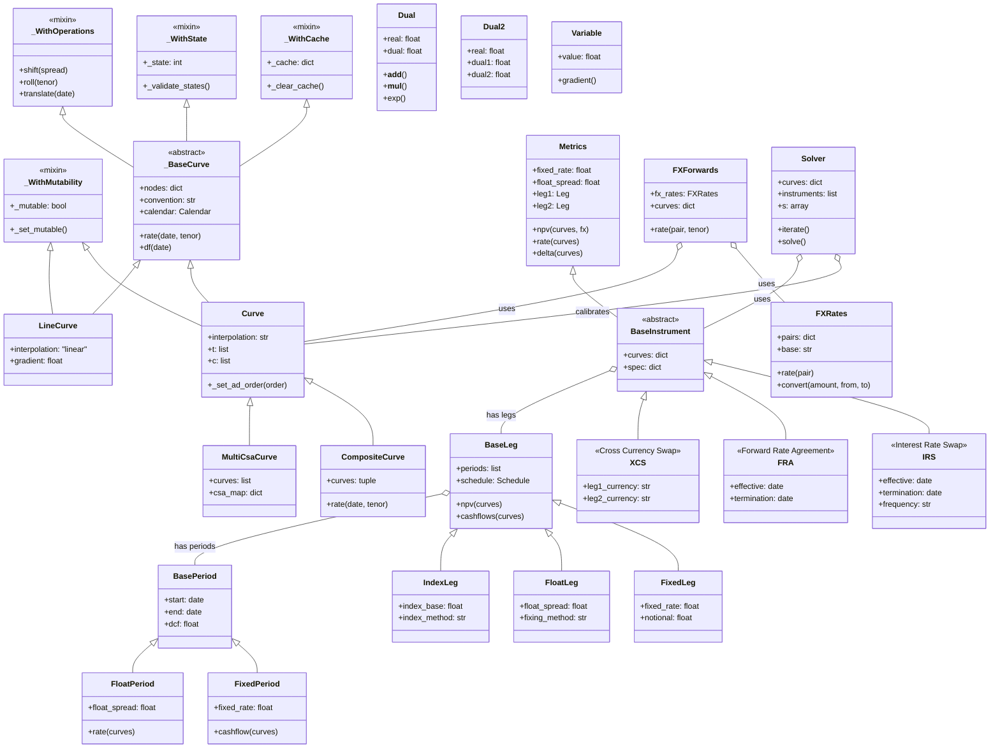
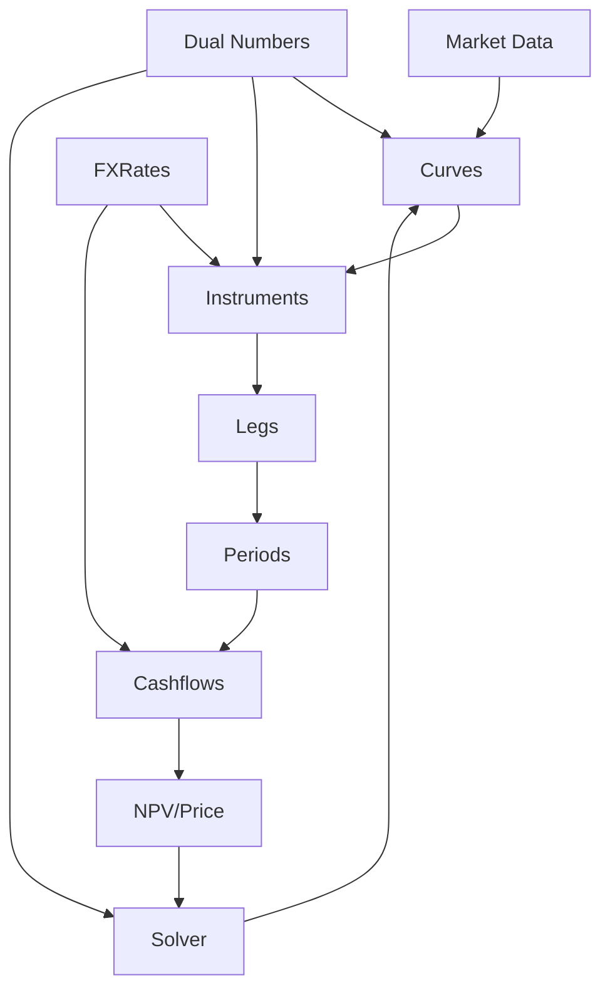
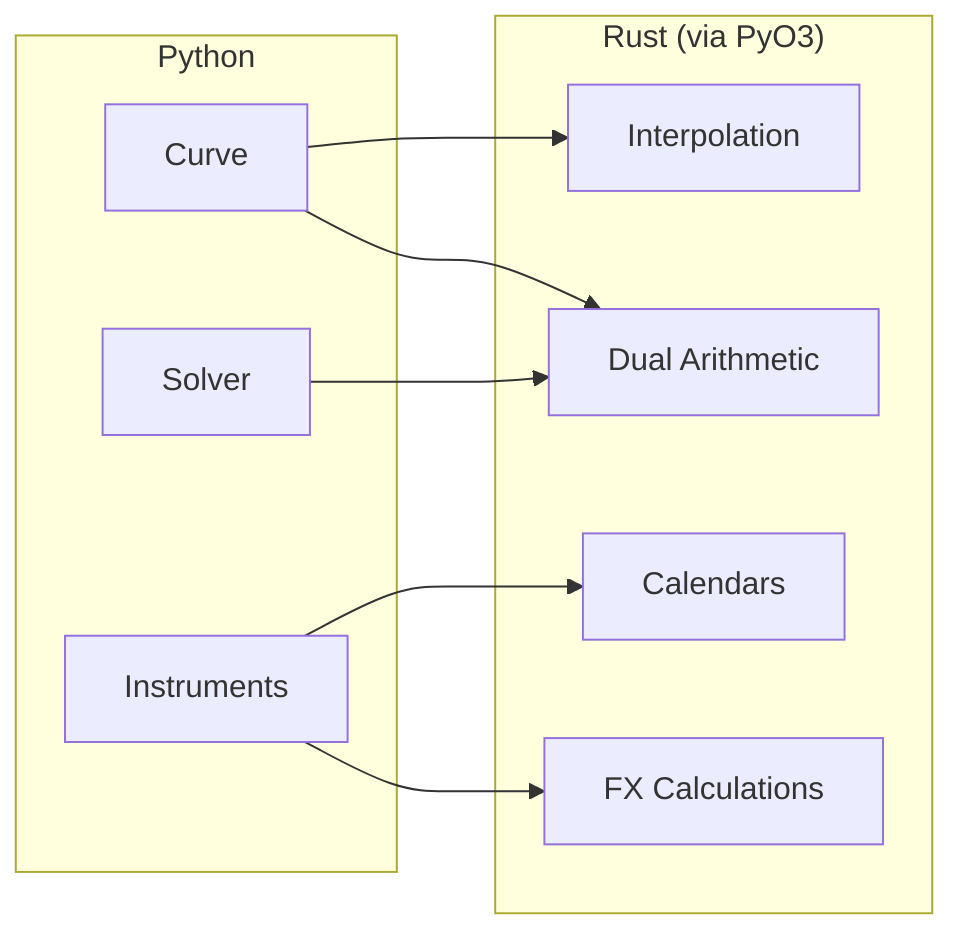
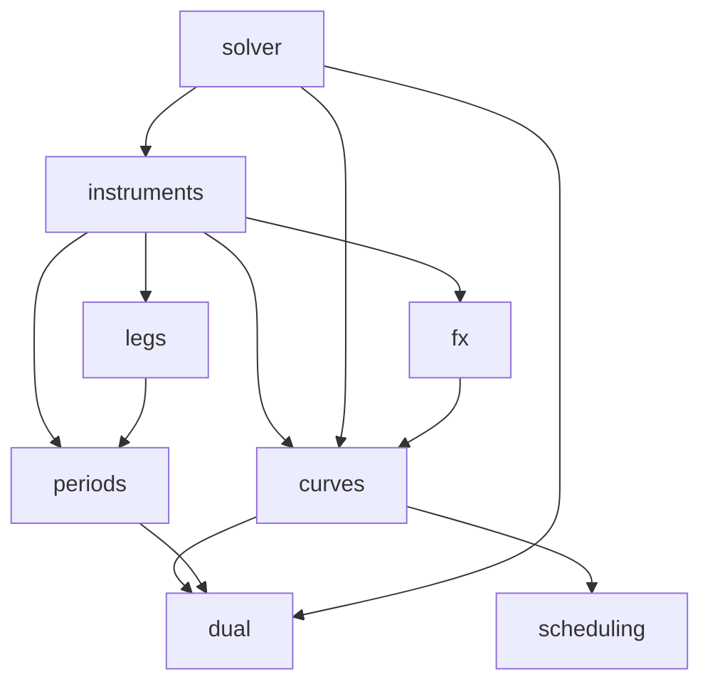
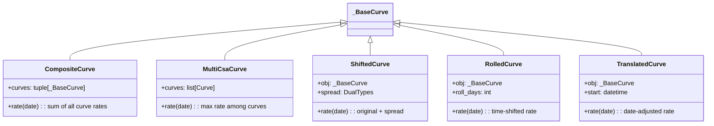
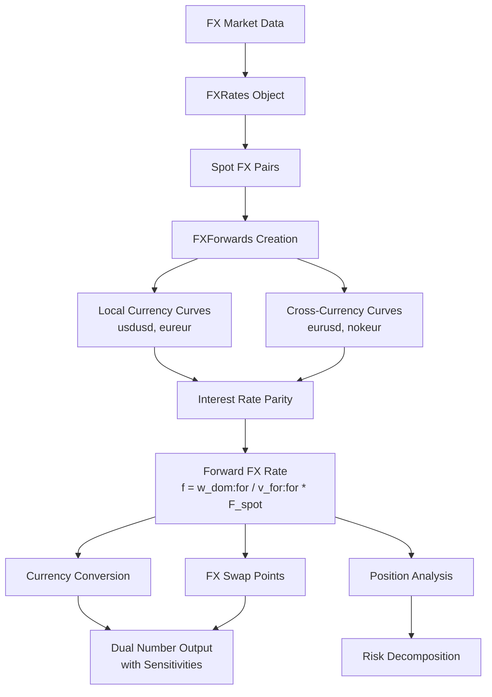
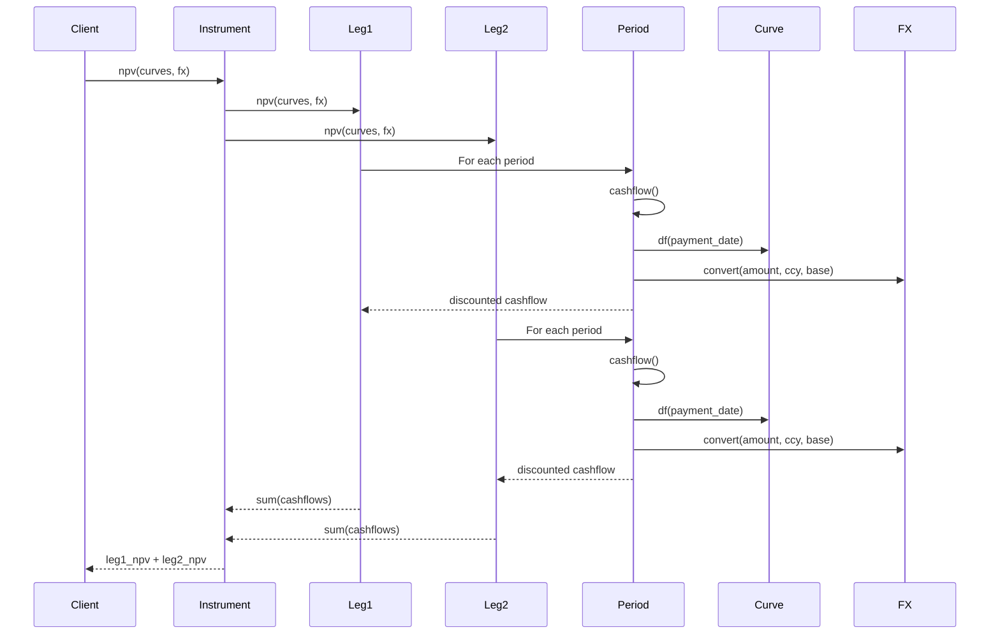
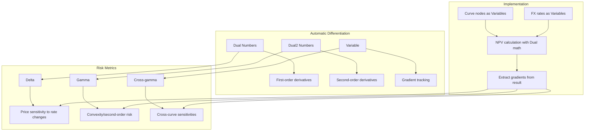

# Rateslib Architecture

## Class Hierarchy Diagram

## Key Design Patterns

### 1. Mixin Architecture
The codebase uses multiple mixins to compose functionality:
- `_WithCache`: Provides caching capabilities for expensive computations
- `_WithState`: Manages state validation across operations
- `_WithOperations`: Adds curve transformation operations (shift, roll, translate)
- `_WithMutability`: Controls whether objects can be modified

### 2. Dual Number System
Automatic differentiation is implemented through:
- `Dual`: First-order derivatives
- `Dual2`: Second-order derivatives
- `Variable`: Gradient tracking
- All mathematical operations are overloaded to propagate derivatives

### 3. Curve Composition
- `Curve`: Base implementation with various interpolation methods
- `LineCurve`: Specialized linear interpolation
- `CompositeCurve`: Sums multiple curves
- `MultiCsaCurve`: Handles multiple collateral agreements

### 4. Instrument-Leg-Period Hierarchy
Financial instruments are decomposed into:
1. **Instruments**: High-level contracts (IRS, FRA, XCS)
2. **Legs**: Payment streams (Fixed, Float, Index)
3. **Periods**: Individual payment periods with cashflow calculations

### 5. FX Integration
- `FXRates`: Spot FX rates with conversion
- `FXForwards`: Forward FX rates using interest rate differentials
- Deep integration with curves for cross-currency instruments

### 6. Solver Pattern
- Calibrates curves to match market instrument prices
- Uses Newton-Raphson with automatic differentiation
- Handles multiple curves and instruments simultaneously

## Data Flow

## Python-Rust Integration

## Module Dependencies

## Detailed Component Analysis

### Curve System Architecture

### FX System Architecture

### Instrument NPV Calculation Flow

### Sensitivity Calculation Architecture

## Performance Optimizations

### Caching Strategy
- `_WithCache` mixin provides automatic memoization
- Curve lookups cached to avoid repeated interpolation
- State validation ensures cache consistency

### Rust Acceleration Points
1. **Interpolation**: All interpolation methods implemented in Rust
2. **Date Arithmetic**: Calendar calculations in Rust
3. **Dual Arithmetic**: Core dual number operations in Rust
4. **FX Calculations**: Currency conversion logic optimized

### Parallel Computation Opportunities
- Multiple curve calibrations can run in parallel
- Independent leg calculations parallelizable
- Sensitivity bumps naturally parallel