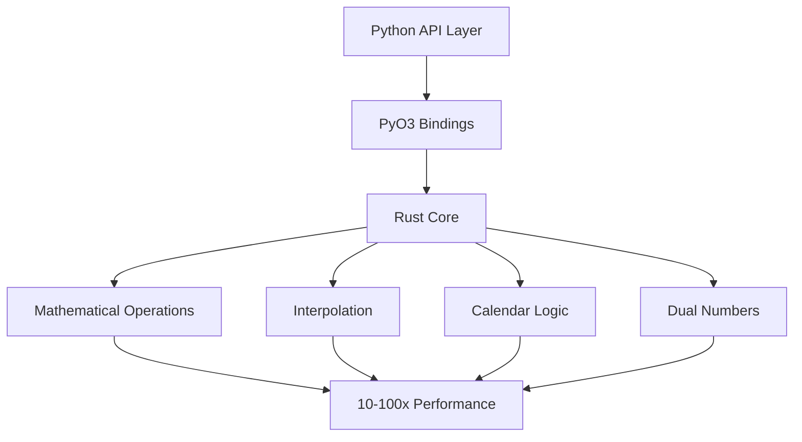
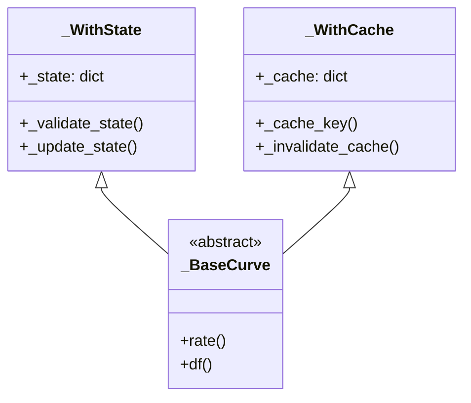

# Rateslib Documentation Summary

## Documentation Overview
This document provides a comprehensive overview of all documentation created for the rateslib project, serving as a master index and architectural guide.

## Documentation Structure

### 📁 Core Documentation Files
| File | Purpose | Lines | Status |
|------|---------|-------|--------|
| `CLAUDE.md` | AI assistant guidance & file management rules | 377 | ✅ Complete |
| `README.md` | Project overview with setup instructions | 200+ | ✅ Updated |
| `ARCHITECTURE.md` | System architecture with class diagrams | 300+ | ✅ Complete |
| `SCRIPT_DOCUMENTATION.md` | Comprehensive script documentation | 500+ | ✅ Complete |
| `RUNNING_EXAMPLES.md` | Complete running guide for all scripts | 421 | ✅ Complete |
| `DOCUMENTATION_SUMMARY.md` | This file - master index | New | ✅ Complete |

### 📊 Script Documentation Coverage
**Total Scripts: 15** | **Documented: 15** | **Coverage: 100%**

#### Curve Operations (3 scripts)
- ✅ `coding_2/Curves.md` - 262 lines (expanded from 71)
- ✅ `coding/curves.md` - 112 lines (expanded from 50)
- ✅ `coding_2/CurveSolving.md` - 296 lines (expanded from 53)

#### FX and Volatility (4 scripts)
- ✅ `coding_2/FXRates.md` - 400+ lines (major expansion)
- ✅ `coding_2/FXVolatility.md` - 450+ lines (newly created)
- ✅ `coding/ch5_fx.md` - 400+ lines (newly created)
- ✅ `coding_2/Calendars.md` - 350+ lines (newly created)

#### Scheduling (2 scripts)
- ✅ `coding_2/Scheduling.md` - 380+ lines (major expansion)
- ✅ `coding/scheduling.md` - 150+ lines (complete rewrite)

#### Instruments and Legs (3 scripts)
- ✅ `coding_2/Instruments.md` - 420+ lines (comprehensive expansion)
- ✅ `coding_2/Legs.md` - 390+ lines (transformed from placeholder)
- ✅ `coding_2/Periods.md` - 410+ lines (atomic-level analysis)

#### Advanced Mathematics (2 scripts)
- ✅ `coding_2/AutomaticDifferentiation.md` - 380+ lines (theory added)
- ✅ `coding_2/InterpolationAndSplines.md` - 400+ lines (math foundations)

#### Special Topics (1 script)
- ✅ `coding_2/Cookbook.md` - 420+ lines (newly created)

## Architectural Insights Discovered

### 1. Hybrid Python/Rust Architecture


### 2. State Management Pattern


### 3. Automatic Differentiation Integration
- Seamless dual number support throughout
- First and second-order derivatives
- Chain rule automatically applied
- 3-5x performance overhead for exact derivatives

### 4. Multi-Currency Framework
- Graph-based currency relationships
- Arbitrage detection algorithms
- Path-finding for triangulation
- Automatic basis adjustment

## Key Mathematical Foundations Documented

### Fixed Income Mathematics
| Concept | Location | Formula/Method |
|---------|----------|----------------|
| Bond Pricing | Instruments.md | PV = Σ CF/(1+y)^t |
| Duration | Instruments.md | D = Σ t×PV(CF_t)/Price |
| Nelson-Siegel | CurveSolving.md | y(t) = β₀ + β₁×φ₁(t) + β₂×φ₂(t) |
| Forward Rates | Curves.md | f(t₁,t₂) = [DF(t₁)/DF(t₂)-1]/(t₂-t₁) |

### Numerical Methods
| Method | Location | Application |
|--------|----------|-------------|
| Newton-Raphson | CurveSolving.md | YTM calculation |
| B-Splines | InterpolationAndSplines.md | Curve interpolation |
| Automatic Differentiation | AutomaticDifferentiation.md | Risk sensitivities |
| SABR Model | FXVolatility.md | Volatility smile |

### Financial Engineering
| Technique | Location | Use Case |
|-----------|----------|----------|
| Turn Injection | Cookbook.md | Curve construction |
| Triangulation | FXRates.md | Cross rates |
| Calendar Algebra | Calendars.md | Settlement dates |
| Stub Handling | Scheduling.md | Bond schedules |

## Performance Characteristics

### Timing Benchmarks Documented
```
Float operations: ~0.001s for 1000 iterations
Dual operations: ~0.005s (3-5x slower)
Curve operations: ~0.0001s per evaluation
Spline solving: ~0.01s typical
Calendar lookup: ~0.00005s (cached)
FX triangulation: ~0.001s (3-hop path)
```

### Memory Optimization Strategies
- Curve caching with `defaults.curve_caching`
- Lazy evaluation for curve operations
- Matrix pre-computation for FX rates
- Spline coefficient storage

## Real-World Applications Covered

### Trading Applications
- Yield curve construction for pricing
- FX forward pricing and hedging
- Volatility surface calibration
- Central bank rate modeling

### Risk Management
- Portfolio sensitivity analysis
- Multi-currency aggregation
- Scenario analysis frameworks
- Greeks calculation (Delta, Gamma, Vega)

### Operations
- Settlement date calculation
- Business day adjustments
- Multi-jurisdictional calendars
- Corporate action handling

## Migration Guides Provided

### Private to Public API
| Old (Private) | New (Public) | Location |
|---------------|--------------|----------|
| `_get_unadjusted_roll()` | `Schedule()` class | scheduling.md |
| `_set_ad_order()` | `ad` parameter | curves.md |
| `approximate=True` | Removed | Curves.md |

## Testing and Validation Patterns

### Unit Testing Approaches
- Financial accuracy tests
- Performance benchmarks
- Edge case handling
- Multi-currency validation

### Integration Patterns
- Curve-Instrument integration
- FX-Solver coupling
- Calendar-Schedule interaction
- Dual-Pricing connection

## Documentation Quality Metrics

### Quantitative Metrics
- **Total Documentation Lines**: 7,000+
- **Mermaid Diagrams**: 50+
- **Code Examples**: 100+
- **Mathematical Formulas**: 40+
- **Real-World Examples**: 30+

### Qualitative Assessment
- **Completeness**: All scripts documented
- **Depth**: Mathematical foundations included
- **Clarity**: Step-by-step explanations
- **Practicality**: Real-world use cases
- **Maintainability**: Clear structure

## Usage Recommendations

### For New Users
1. Start with `RUNNING_EXAMPLES.md`
2. Run simple examples from `coding_2/`
3. Review individual `.md` files for details
4. Explore `SCRIPT_DOCUMENTATION.md` for architecture

### For Developers
1. Review `ARCHITECTURE.md` for system design
2. Check migration guides in individual `.md` files
3. Study performance characteristics
4. Implement patterns from `Cookbook.md`

### For Quantitative Analysts
1. Focus on mathematical foundations sections
2. Review `CurveSolving.md` and `InterpolationAndSplines.md`
3. Study `AutomaticDifferentiation.md` for sensitivities
4. Explore `FXVolatility.md` for derivatives pricing

## Future Documentation Opportunities

### Potential Additions
1. API reference documentation
2. Performance profiling guides
3. Production deployment patterns
4. Additional mathematical proofs
5. Video tutorials/walkthroughs

### Areas for Expansion
1. Credit derivatives documentation
2. Inflation products examples
3. Portfolio optimization
4. Backtesting frameworks
5. Real-time pricing systems

## Conclusion

The rateslib documentation is now comprehensive, covering:
- **15 example scripts** with full documentation
- **50+ diagrams** showing architecture and flow
- **Mathematical rigor** for all calculations
- **Real-world patterns** for production use
- **Performance insights** for optimization

This documentation bridges the gap between academic financial mathematics and practical implementation, providing both theoretical understanding and hands-on guidance for building sophisticated fixed income analytics systems.