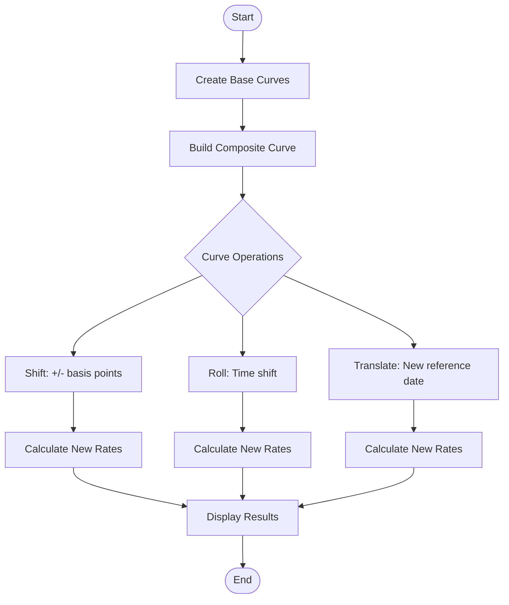
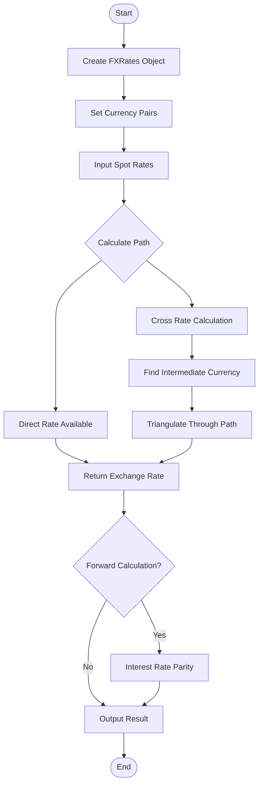
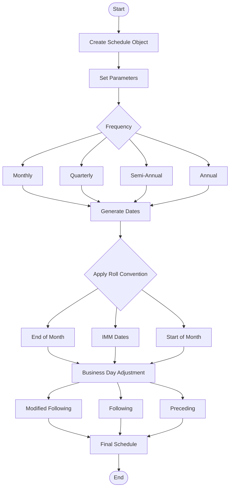
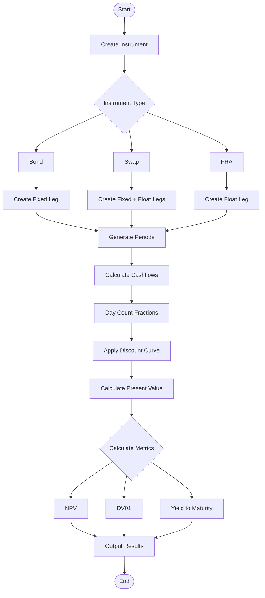
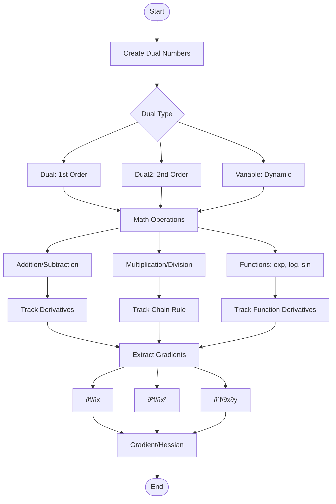
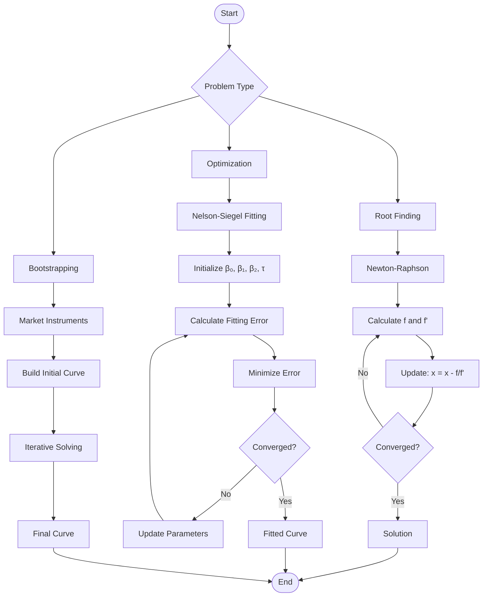
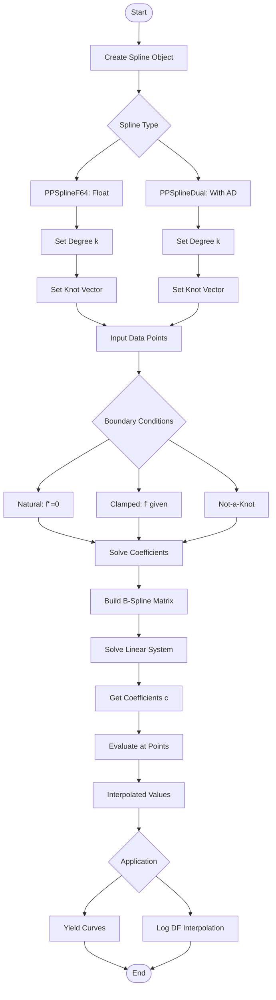

# Rateslib Script Documentation

This document provides comprehensive documentation for all converted Jupyter notebooks, including flow charts, examples, and known issues.

## Table of Contents
1. [Curve Operations](#curve-operations)
2. [FX Rates and Forwards](#fx-rates-and-forwards)
3. [Scheduling and Date Generation](#scheduling-and-date-generation)
4. [Instruments and Pricing](#instruments-and-pricing)
5. [Automatic Differentiation](#automatic-differentiation)
6. [Curve Solving and Optimization](#curve-solving-and-optimization)
7. [Interpolation and Splines](#interpolation-and-splines)

---

## Curve Operations

### Scripts
- `coding_2/Curves.py` - Basic curve operations
- `coding/curves.py` - Contains private API usage (needs updating)

### Flow Chart


### Key Concepts
- **Composite Curves**: Sum multiple curves together
- **Automatic Differentiation**: Track sensitivities through operations
- **Curve Operations**: Shift (parallel), Roll (time), Translate (reference)

### Example Usage
```python
from rateslib import dt, Curve, LineCurve, CompositeCurve

# Create individual curves
curve1 = LineCurve({dt(2022, 1, 1): 2.0, dt(2023, 1, 1): 3.0})
curve2 = LineCurve({dt(2022, 1, 1): 0.5, dt(2023, 1, 1): 1.0})

# Composite curve (sum of curves)
composite = CompositeCurve(curves=(curve1, curve2))

# Operations
shifted = composite.shift(50)  # +50 basis points
rolled = composite.roll("30d")  # Roll forward 30 days
```

---

## FX Rates and Forwards

### Scripts
- `coding_2/FXRates.py` - FX functionality demonstration

### Flow Chart


### Key Concepts
- **FX Triangulation**: Calculate cross rates through intermediate currencies
- **Interest Rate Parity**: Forward FX = Spot × (1+r_domestic)/(1+r_foreign)
- **Rate Convention**: Always quote as Base/Quote (e.g., EUR/USD)

### Example Usage
```python
from rateslib import FXRates, FXForwards, dt

# Create FX rates
fx = FXRates({"eurusd": 1.10, "gbpusd": 1.25})

# Get cross rate
eurgbp = fx.rate("eurgbp")  # Calculated via USD

# Forward rates
fxf = FXForwards(
    fx_rates=fx,
    curves={"eur": eur_curve, "usd": usd_curve}
)
forward_rate = fxf.rate("eurusd", dt(2023, 1, 1))
```

---

## Scheduling and Date Generation

### Scripts
- `coding_2/Scheduling.py` - Date scheduling functionality
- `coding/scheduling.py` - Contains private API usage (deprecated)

### Flow Chart


### Important Note
- Original notebook used private functions that have been removed
- Modern code should use the public `Schedule` class API

### Corrected Usage
```python
from rateslib import Schedule, dt

# Create schedule with public API
schedule = Schedule(
    effective=dt(2022, 1, 1),
    termination=dt(2025, 1, 1),
    frequency="Q",  # Quarterly
    stub="SHORT_FRONT",
    roll="EOM",  # End of month
    calendar="NYC",
    modifier="MF"  # Modified following
)

# Get schedule dates
dates = schedule.dates
```

---

## Instruments and Pricing

### Scripts
- `coding_2/Instruments.py` - Bond pricing examples
- `coding_2/Legs.py` - Cash flow leg structures
- `coding_2/Periods.py` - Period and cashflow generation

### Flow Chart


### Key Concepts
- **Legs**: Collections of cashflow periods
- **Periods**: Individual payment intervals
- **Cashflows**: Actual payment amounts with timing
- **Metrics**: NPV, DV01, Yield, Duration

### Example Usage
```python
from rateslib import FixedRateBond, dt

# Create bond
bond = FixedRateBond(
    effective=dt(2022, 1, 1),
    termination=dt(2027, 1, 1),
    frequency="S",  # Semi-annual
    coupon=5.0,  # 5% coupon
    convention="ACT360"
)

# Price with curve
npv = bond.npv(curve)
ytm = bond.ytm(price=102.5)
duration = bond.duration(curve)
```

---

## Automatic Differentiation

### Scripts
- `coding_2/AutomaticDifferentiation.py` - AD demonstration with formatted output

### Flow Chart


### Key Concepts
- **Dual Numbers**: Carry value and derivatives together
- **Automatic**: Derivatives calculated during forward pass
- **Exact**: Machine precision, not finite differences
- **Chain Rule**: Automatically applied through operations

### Example Usage
```python
from rateslib import Dual, Dual2, gradient

# First order derivatives
x = Dual(2.0, ["x"], [])
y = Dual(3.0, ["y"], [])
f = x**2 + x*y + dual_exp(y)

# Extract gradient
grad = gradient(f, ["x", "y"])

# Second order (Hessian)
x2 = Dual2(2.0, ["x", "y"], [1, 0], [])
y2 = Dual2(3.0, ["x", "y"], [0, 1], [])
f2 = x2**2 + x2*y2 + dual_exp(y2)

hessian = gradient(f2, ["x", "y"], order=2)
```

---

## Curve Solving and Optimization

### Scripts
- `coding_2/CurveSolving.py` - Curve solving techniques

### Flow Chart


### Key Concepts
- **Bootstrapping**: Sequential solving from liquid instruments
- **Newton-Raphson**: Fast convergence with derivatives
- **Nelson-Siegel**: Parametric yield curve model
- **Inverse Function Theorem**: Find input from output

### Example Usage
```python
from rateslib.dual import newton_1dim, ift_1dim

# Newton-Raphson for YTM
def bond_price_error(ytm, market_price, cashflows):
    theoretical = sum(cf/(1+ytm)**t for cf, t in cashflows)
    derivative = sum(-t*cf/(1+ytm)**(t+1) for cf, t in cashflows)
    return theoretical - market_price, derivative

ytm = newton_1dim(bond_price_error, g0=0.05, args=(102.5, cashflows))

# Inverse function theorem
def price_from_rate(rate):
    return 100/(1+rate)**2

rate = ift_1dim(price_from_rate, target_price=95.0)
```

---

## Interpolation and Splines

### Scripts
- `coding_2/InterpolationAndSplines.py` - Spline interpolation with visualization

### Flow Chart


### Key Concepts
- **B-Splines**: Piecewise polynomials with local support
- **Degree k**: Polynomial degree (3=cubic, 4=quartic)
- **Knot Vector**: Defines spline segments
- **Log-Spline**: Interpolate log(DF) for positivity

### Example Usage
```python
from rateslib import PPSplineF64, PPSplineDual, dt
from math import log, exp

# Create cubic spline
spline = PPSplineF64(
    k=3,  # Cubic
    t=[0, 0, 0, 0, 1, 2, 2, 2, 2]  # Knot vector
)

# Solve with data points
spline.csolve(
    tau=[0, 0.5, 1, 1.5, 2],  # x-values
    y=[1.0, 1.2, 1.5, 1.4, 1.3],  # y-values
    left_n=0,  # Natural boundary
    right_n=0,
    allow_lsq=False
)

# Evaluate
value = spline.ppev_single(0.75)

# Log-spline for discount factors
log_spline = PPSplineF64(k=4, t=knots)
log_spline.csolve(
    tau=dates,
    y=[log(df) for df in discount_factors],
    left_n=2, right_n=2
)
# Convert back: df = exp(log_spline.ppev_single(t))
```

---

## Summary of Key Issues and Solutions

### Private API Usage
**Issue**: Some notebooks use private functions (starting with `_`)
**Solution**: Replace with public API equivalents

| Private Function | Public Replacement |
|-----------------|-------------------|
| `_get_unadjusted_roll()` | `Schedule().dates` property |
| `set_ad_order()` | Use `ad` parameter in constructor |
| Direct attribute access | Use property methods |

### Import Best Practices
Always run scripts from `python/` directory:
```bash
cd python/
python scripts/examples/coding_2/Curves.py
```

### Performance Considerations
- Automatic differentiation: ~3-5x slower than pure floats
- Exact calculation preferred over approximation for accuracy
- Spline evaluation: O(k) complexity per point

### Testing Recommendations
1. Verify all imports work from `python/` directory
2. Check that enhanced versions produce same results as originals
3. Test with different curve types and interpolation methods
4. Validate AD results against finite differences