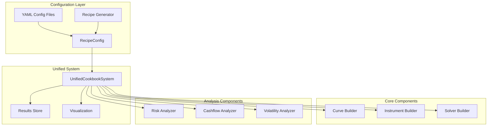

# Unified Cookbook System Architecture

## Overview

The Unified Cookbook System provides a single, configurable framework that can replicate all 28 cookbook recipes through modular components and YAML configuration. This architecture promotes code reuse, maintainability, and extensibility.

## System Architecture



## Key Components

### 1. Configuration Classes

**Purpose**: Define the structure and types for all configuration options.

```python
@dataclass
class CurveConfig:
    id: str
    interpolation: InterpolationType
    convention: str = "act360"
    calendar: str = "all"
    nodes: Dict[dt, float]
    knot_sequence: Optional[List[dt]]  # For mixed interpolation
    index_base: Optional[float]  # For inflation curves
```

**Benefits**:
- Type safety through dataclasses
- Clear parameter documentation
- Validation at configuration time
- Easy serialization to/from YAML

### 2. Builder Pattern

**Purpose**: Factory classes that construct complex objects from configuration.

```python
class CurveBuilder:
    @staticmethod
    def build(config: CurveConfig) -> Curve:
        # Handle different curve types
        if config.index_base:
            return IndexCurve(...)
        elif config.interpolation == InterpolationType.MIXED:
            return MixedCurve(...)
        else:
            return Curve(...)
```

**Benefits**:
- Separates construction logic from business logic
- Handles complex initialization patterns
- Supports multiple curve/instrument types
- Easy to extend with new types

### 3. Analyzer Components

**Purpose**: Encapsulate common analysis functions used across recipes.

```python
class RiskAnalyzer:
    @staticmethod
    def calculate_dv01(instrument, curve) -> float
    def calculate_duration(instrument, curve) -> float
    def calculate_convexity(instrument, curve) -> float
    def calculate_theta(instrument, curve, days=1) -> float
```

**Benefits**:
- Reusable analysis functions
- Consistent calculations across recipes
- Testable in isolation
- Easy to add new metrics

### 4. Unified System Core

**Purpose**: Orchestrates the execution of any recipe through configuration.

```python
class UnifiedCookbookSystem:
    def execute_recipe(config: RecipeConfig) -> Dict[str, Any]:
        # 1. Build curves
        # 2. Build instruments  
        # 3. Run solvers
        # 4. Generate outputs
        # 5. Return results
```

**Benefits**:
- Single entry point for all recipes
- Consistent execution flow
- Centralized error handling
- Result caching and storage

## Configuration Structure

### YAML Configuration Example

```yaml
name: "Recipe 1: Single Currency Curve"
description: "Replicating single currency curve from the book"

curves:
  - id: "eur"
    interpolation: "log_linear"
    convention: "act365f"
    calendar: "tgt"
    nodes:
      2024-01-01: 1.0
      2024-03-15: 1.0
      2024-06-15: 1.0

instruments:
  - type: "irs"
    effective: "2024-01-01"
    termination: "1Y"
    frequency: "Q"
    convention: "act360"

solvers:
  - id: "eur_solver"
    curves: ["eur"]
    instruments: [0, 1, 2]  # References to instruments
    market_rates: [3.5, 3.6, 3.7]

outputs:
  - "curve_rates"
  - "npv"
  - "risk"
  - "cashflows"
```

## Common Patterns Identified

### 1. Curve Construction Pattern

All recipes follow a similar curve construction pattern:
1. Define nodes (dates and initial values)
2. Select interpolation method
3. Set conventions (day count, calendar)
4. Calibrate using market instruments

**Unified Approach**: `CurveBuilder` handles all variations through configuration.

### 2. Solver Dependency Pattern

Many recipes have solver dependencies:
1. Solve base curves (EUR, USD)
2. Use results in dependent curves (XCS)
3. Chain multiple solvers

**Unified Approach**: `SolverBuilder` manages pre-solvers and dependencies.

### 3. Risk Calculation Pattern

All recipes calculate similar risk metrics:
1. NPV calculation
2. Sensitivity analysis (DV01, duration)
3. Greeks for derivatives

**Unified Approach**: `RiskAnalyzer` provides standard calculations.

### 4. Output Generation Pattern

Recipes generate similar outputs:
1. Curve rates at standard tenors
2. Instrument valuations
3. Risk metrics
4. Cash flow schedules

**Unified Approach**: Configurable output generation through `outputs` list.

## Extensibility

### Adding New Curve Types

```python
# In CurveBuilder.build()
elif config.curve_type == "nelson_siegel":
    return NelsonSiegelCurve(
        beta0=config.params['beta0'],
        beta1=config.params['beta1'],
        beta2=config.params['beta2'],
        tau=config.params['tau']
    )
```

### Adding New Instruments

```python
# In InstrumentBuilder.build()
elif config.type == InstrumentType.CAPFLOOR:
    return CapFloor(
        strike=config.strike,
        volatility=config.volatility,
        ...
    )
```

### Adding New Analysis

```python
class VolatilityAnalyzer:
    @staticmethod
    def calibrate_sabr(market_vols, strikes, expiry):
        # SABR calibration logic
        return sabr_params
```

## Benefits of Unified System

### 1. Code Reuse
- Single implementation of common functions
- No duplication across recipes
- Consistent behavior

### 2. Maintainability
- Fix bugs in one place
- Easy to update calculations
- Clear separation of concerns

### 3. Testability
- Test components in isolation
- Mock configurations for testing
- Validate outputs consistently

### 4. Flexibility
- YAML configuration for non-programmers
- Programmatic generation for automation
- Mix and match components

### 5. Performance
- Cache intermediate results
- Reuse curves across instruments
- Parallel execution capability

## Usage Examples

### Execute Single Recipe

```python
system = UnifiedCookbookSystem()
results = system.execute_recipe("config/recipe_01.yml")
```

### Generate Recipe Programmatically

```python
recipe = RecipeGenerator.generate_single_curve_recipe(
    curve_type="mixed",
    tenors=["1M", "3M", "6M", "1Y", "2Y", "5Y"],
    rates=[5.0, 4.9, 4.8, 4.7, 4.5, 4.3]
)
results = system.execute_recipe(recipe)
```

### Compare Multiple Recipes

```python
recipes = [
    "config/recipe_01.yml",
    "config/recipe_02.yml",
    "config/recipe_03.yml"
]
comparison = system.compare_recipes(recipes)
```

### Batch Execution

```python
for i in range(1, 29):
    config = f"config/recipe_{i:02d}.yml"
    results = system.execute_recipe(config)
    system.save_results(f"output/recipe_{i:02d}.json")
```

## Migration Path

### From Individual Scripts to Unified System

1. **Extract Configuration**: Identify parameters in existing recipes
2. **Create YAML**: Convert parameters to YAML configuration
3. **Map Components**: Map existing code to unified components
4. **Validate Results**: Ensure outputs match original
5. **Deprecate Old Code**: Remove redundant implementations

### Example Migration

**Original Recipe 1**:
```python
def recipe_01_single_currency_curve():
    curve = Curve(nodes={...}, interpolation="log_linear")
    solver = Solver(curves=[curve], ...)
    return {"curve": curve, "solver": solver}
```

**Unified Configuration**:
```yaml
curves:
  - id: "main"
    interpolation: "log_linear"
    nodes: {...}
solvers:
  - id: "main_solver"
    curves: ["main"]
```

## Performance Considerations

### Caching Strategy
- Cache curves after calibration
- Reuse solver results
- Store intermediate calculations

### Parallel Execution
- Independent curves in parallel
- Batch instrument pricing
- Concurrent risk calculations

### Memory Management
- Clear cache between recipes
- Lazy loading of large datasets
- Efficient data structures

## Future Enhancements

1. **GUI Interface**: Web-based configuration builder
2. **Real-time Data**: Integration with market data feeds
3. **Cloud Deployment**: Scalable execution on cloud platforms
4. **Version Control**: Track configuration changes
5. **Reporting**: Automated report generation
6. **Optimization**: Parameter optimization framework
7. **Machine Learning**: Pattern recognition in configurations

## Conclusion

The Unified Cookbook System transforms 28 individual recipe implementations into a single, modular, configurable framework. This architecture provides:

- **Consistency**: Same components used across all recipes
- **Flexibility**: YAML configuration or programmatic generation
- **Extensibility**: Easy to add new curves, instruments, and analysis
- **Maintainability**: Single source of truth for calculations
- **Scalability**: From single recipes to batch processing

The system demonstrates best practices in software architecture, including separation of concerns, dependency injection, factory patterns, and configuration-driven development.