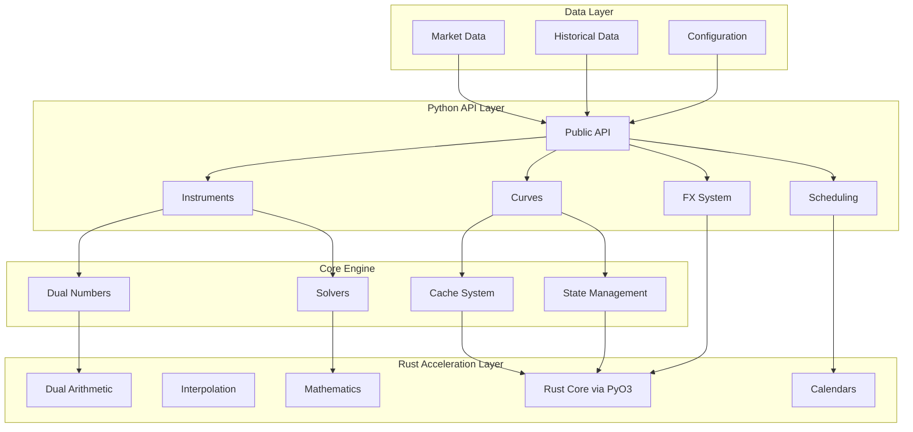
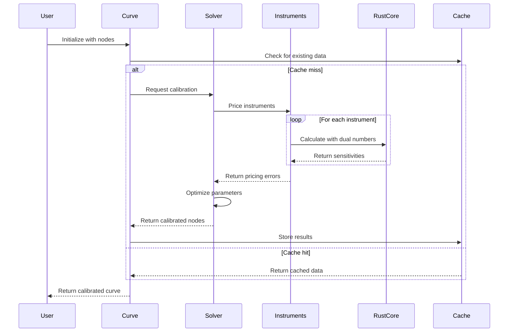
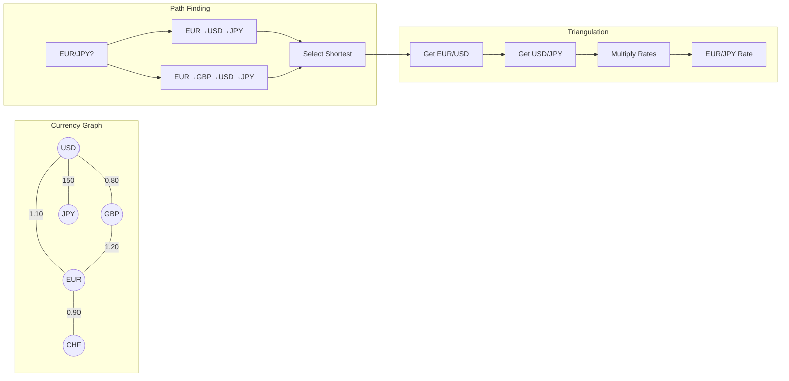
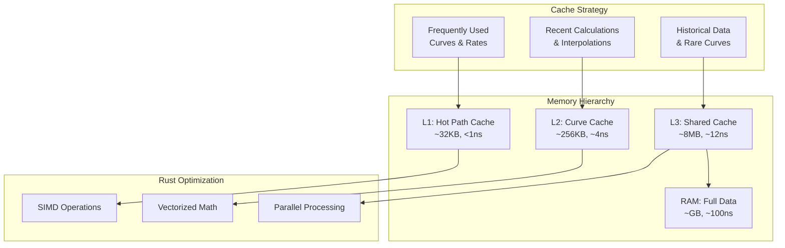
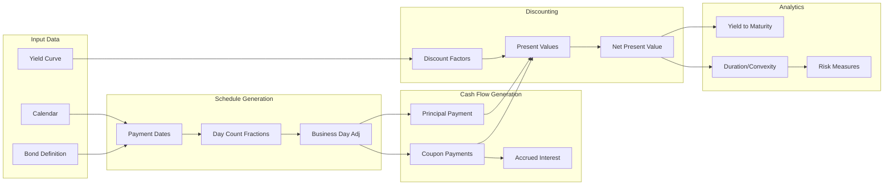
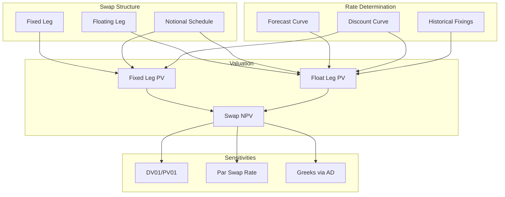
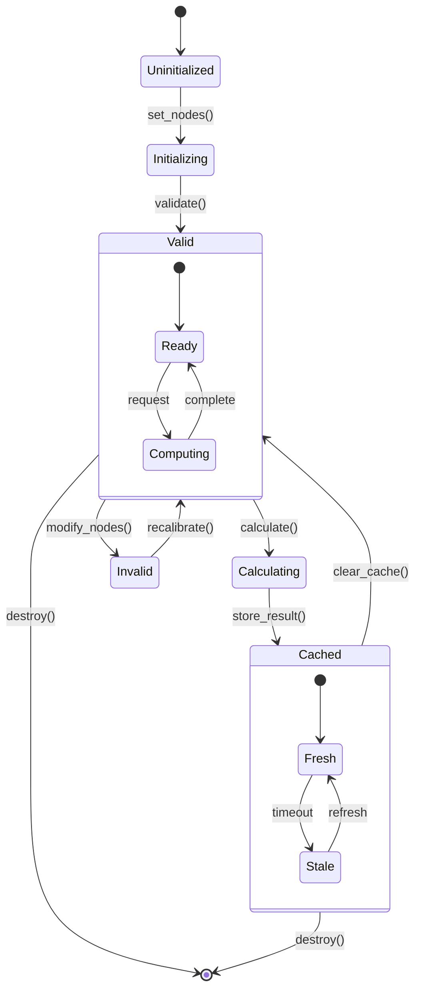
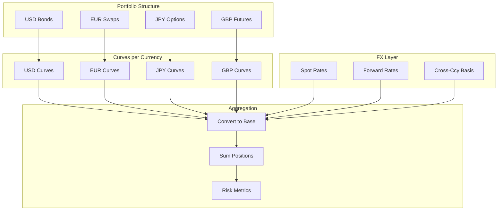
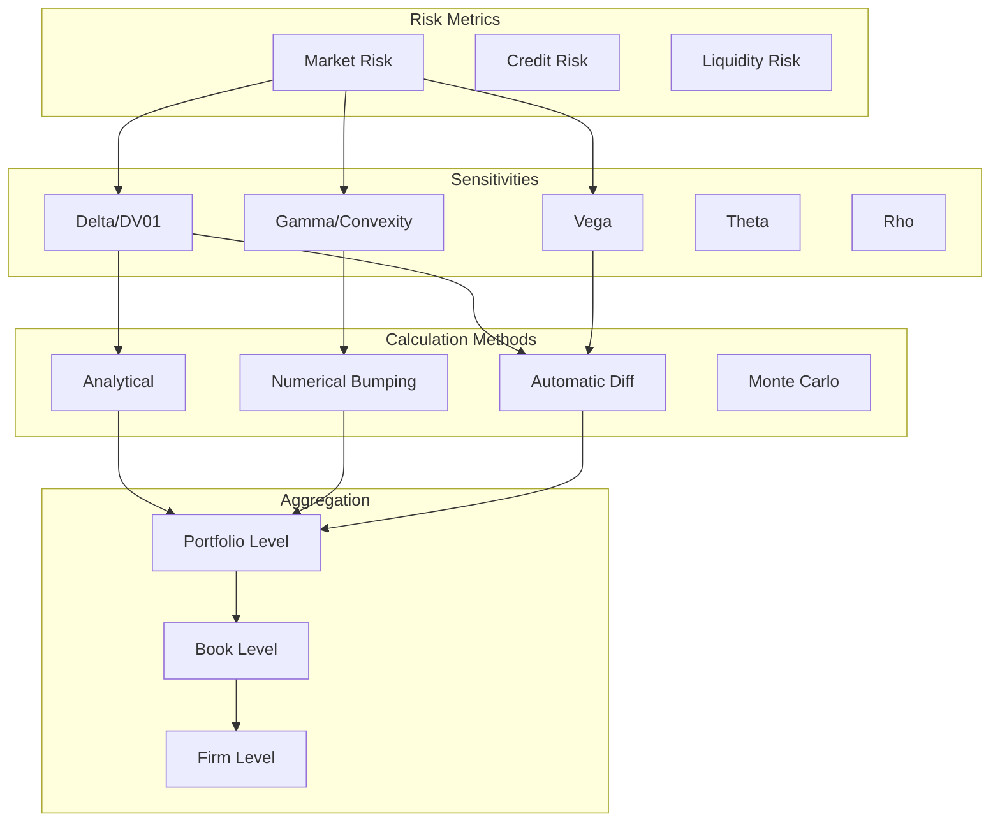
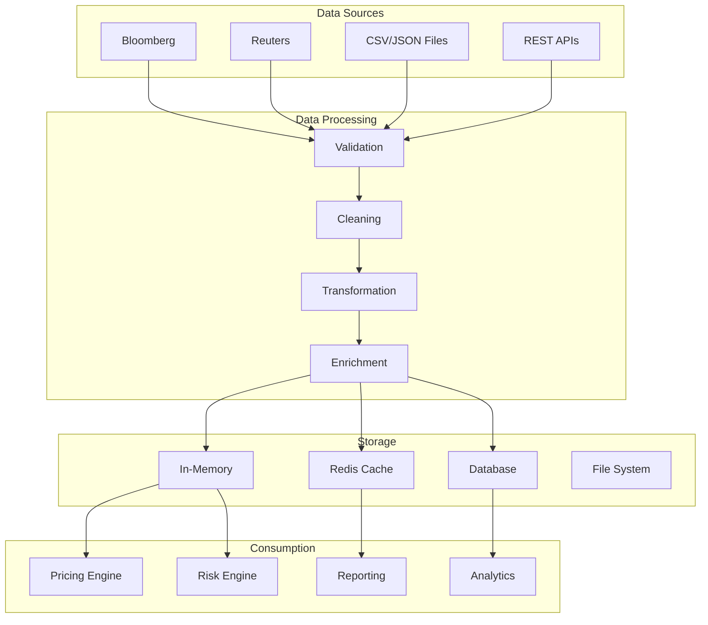

# Rateslib Visual Architecture Documentation

## System-Wide Architecture Overview



## Detailed Component Interactions

### 1. Curve Construction Pipeline



### 2. FX System Graph Theory



### 3. Automatic Differentiation Flow

```mermaid
flowchart TD
    subgraph "Dual Number Structure"
        Real[Real Value]
        Dual1[First Derivatives]
        Dual2[Second Derivatives]
    end
    
    subgraph "Operations"
        Add[Addition: (a+b, da+db, d²a+d²b)]
        Mul[Multiplication: (a×b, a×db+b×da, ...)]
        Exp[Exponential: (e^a, e^a×da, ...)]
        Log[Logarithm: (ln(a), da/a, ...)]
    end
    
    subgraph "Application"
        Price[Option Price]
        Delta[∂P/∂S = Delta]
        Gamma[∂²P/∂S² = Gamma]
        Vega[∂P/∂σ = Vega]
    end
    
    Real --> Add
    Dual1 --> Add
    Dual2 --> Add
    
    Add --> Mul
    Mul --> Exp
    Exp --> Log
    
    Log --> Price
    Price --> Delta
    Price --> Gamma
    Price --> Vega
```

## Performance Architecture

### Memory Layout and Caching Strategy



### Computational Complexity Analysis

```mermaid
graph LR
    subgraph "Operations Complexity"
        Linear[Linear Interpolation<br/>O(log n)]
        Spline[Spline Evaluation<br/>O(log n)]
        Solving[Curve Solving<br/>O(n² × m)]
        FXPath[FX Path Finding<br/>O(V + E)]
    end
    
    subgraph "Optimization Techniques"
        Binary[Binary Search<br/>for Nodes]
        Cache[Result Caching<br/>O(1) lookup]
        Precomp[Pre-computation<br/>of Coefficients]
        Rust[Rust Acceleration<br/>10-100x speedup]
    end
    
    Linear --> Binary
    Spline --> Precomp
    Solving --> Cache
    FXPath --> Rust
```

## Instrument Pricing Architecture

### Bond Pricing Pipeline



### Swap Valuation Architecture



## State Management Pattern



## Multi-Currency Portfolio Architecture



## Solver Architecture

```mermaid
flowchart TD
    subgraph "Solver Types"
        Newton[Newton-Raphson]
        LM[Levenberg-Marquardt]
        Trust[Trust Region]
        BFGS[BFGS Quasi-Newton]
    end
    
    subgraph "Problem Setup"
        Objective[Objective Function]
        Jacobian[Jacobian Matrix]
        Constraints[Constraints]
    end
    
    subgraph "Iteration"
        Eval[Evaluate f(x)]
        Gradient[Calculate ∇f(x)]
        Direction[Search Direction]
        Step[Line Search]
        Update[Update x]
    end
    
    subgraph "Convergence"
        Check{Converged?}
        Tolerance[|f(x)| < ε]
        MaxIter[iter < max]
    end
    
    Objective --> Eval
    Jacobian --> Gradient
    Constraints --> Direction
    
    Newton --> Direction
    LM --> Direction
    Trust --> Direction
    BFGS --> Direction
    
    Eval --> Gradient
    Gradient --> Direction
    Direction --> Step
    Step --> Update
    Update --> Check
    
    Check -->|No| Eval
    Check -->|Yes| Tolerance
    Tolerance --> MaxIter
```

## Calendar System Architecture

```mermaid
graph LR
    subgraph "Calendar Types"
        Named[Named Calendars<br/>NYC, LDN, TGT]
        Custom[Custom Calendars<br/>User Defined]
        Union[Union Calendars<br/>Multiple Centers]
    end
    
    subgraph "Operations"
        IsBD[Is Business Day?]
        AddBD[Add Business Days]
        Adjust[Adjust Date]
        Roll[Roll Convention]
    end
    
    subgraph "Cache Layer"
        PreCache[Pre-cached Common]
        Dynamic[Dynamic Cache]
        LRU[LRU Eviction]
    end
    
    subgraph "Rust Backend"
        BitSet[BitSet Holidays]
        FastLookup[O(1) Lookup]
        SIMD2[SIMD Date Ops]
    end
    
    Named --> PreCache
    Custom --> Dynamic
    Union --> Dynamic
    
    PreCache --> IsBD
    Dynamic --> IsBD
    
    IsBD --> BitSet
    AddBD --> FastLookup
    Adjust --> SIMD2
    Roll --> FastLookup
```

## Risk System Architecture



## Data Flow Architecture



## Summary

This visual architecture documentation reveals rateslib's sophisticated design:

1. **Hybrid Architecture**: Seamless Python/Rust integration via PyO3
2. **Performance Optimization**: Multi-level caching and SIMD operations
3. **Mathematical Rigor**: Automatic differentiation throughout
4. **Scalability**: Efficient state management and parallel processing
5. **Flexibility**: Composable components with clean interfaces

The architecture supports institutional-grade fixed income analytics while maintaining code clarity and performance.