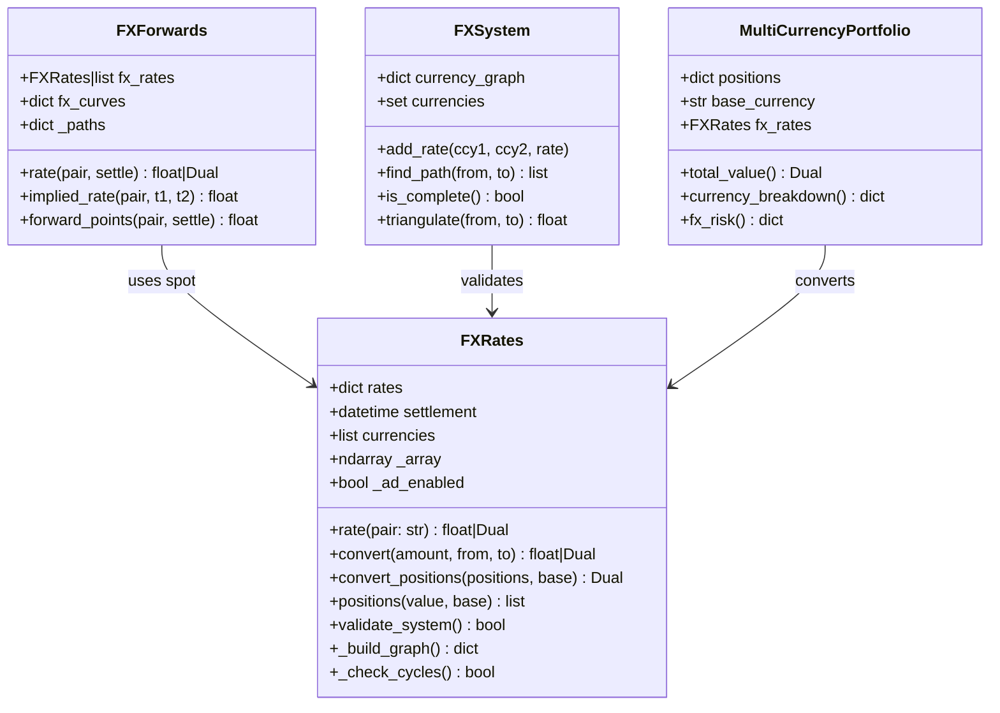
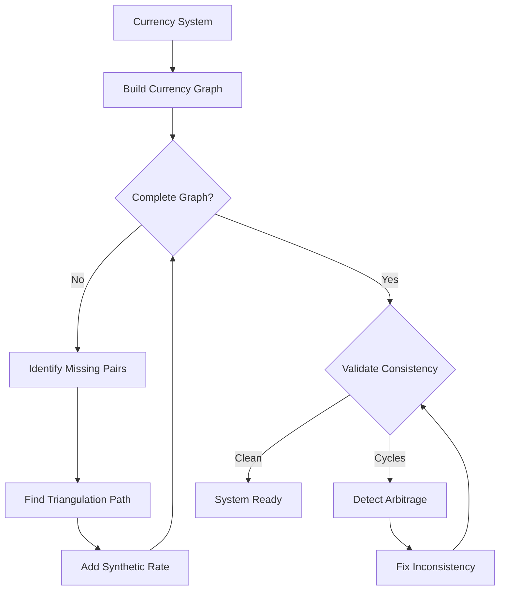
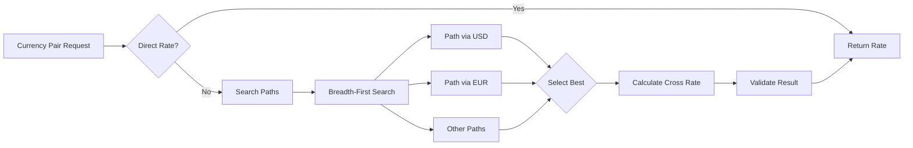
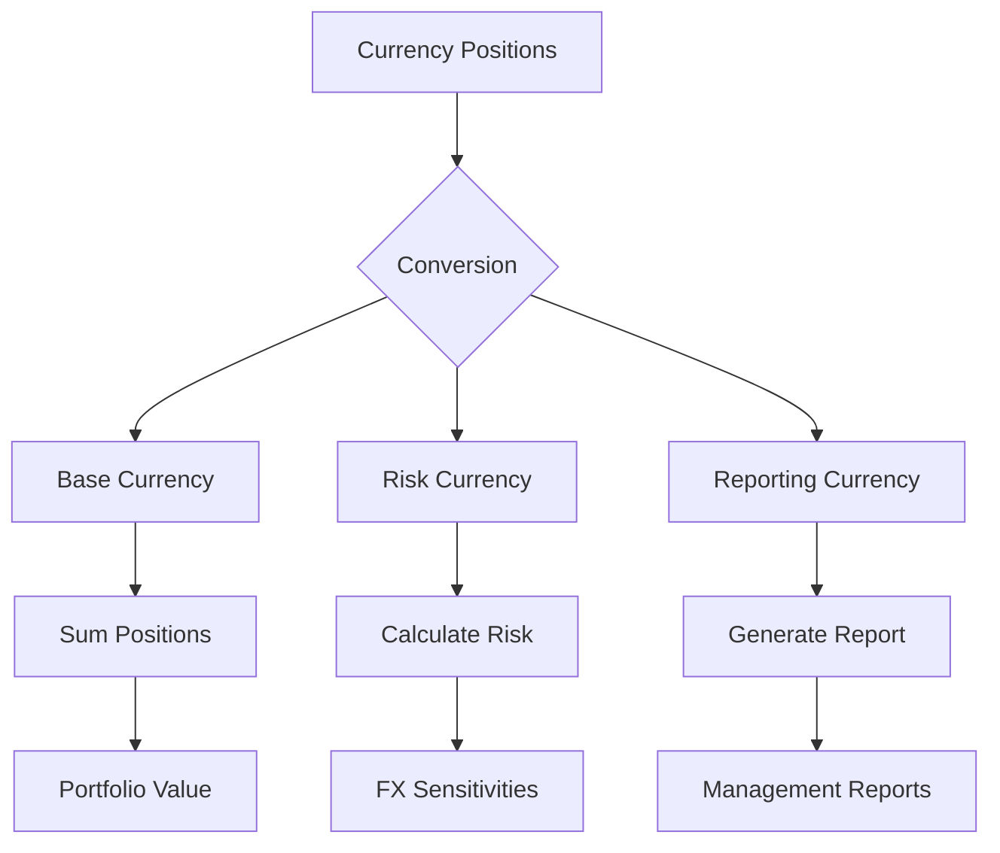
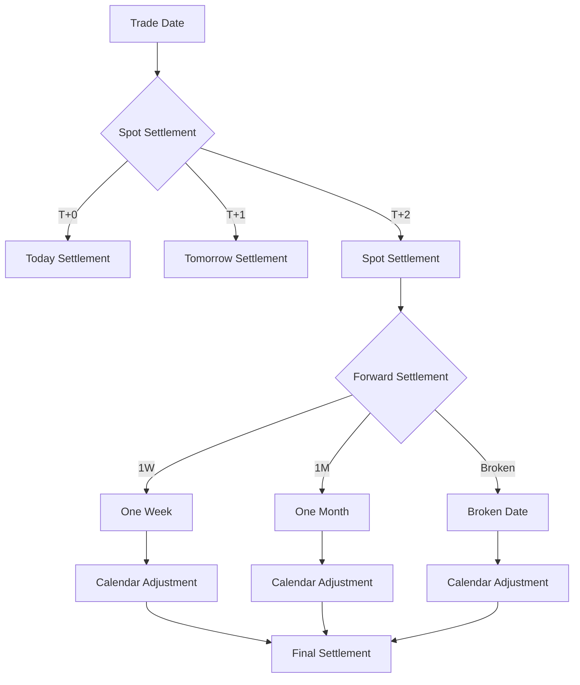

# ch5_fx.py Documentation

## Overview
Comprehensive FX rates functionality demonstration from Chapter 5, covering FX rate systems, forwards, dual number representations, and complex multi-currency scenarios. This script showcases the complete FX framework in rateslib.

## Key Concepts
- **FX System Validation**: Ensuring consistent and arbitrage-free rate systems
- **Multi-Currency Aggregation**: Position management across currencies
- **Dual Number Integration**: Automatic differentiation for FX sensitivities
- **Forward Pricing**: Interest rate parity implementation
- **Cyclic Dependencies**: Handling and detecting circular FX relationships

## Command to Run
```bash
cd /home/peter/rateslib/python
python ../scripts/examples/coding/ch5_fx.py
```

## Expected Output
```
Unsuitable initialisation warnings
FX Rates Array displays
Cross-currency calculations (e.g., EUR/GBP from triangulation)
Dual number representations with derivatives
Base value conversions and position breakdowns
FX forward calculations with dates
Delta risk equivalence demonstrations
System validation errors for cyclic dependencies
Script completed successfully!
```

## FX System Architecture

### Complete FX Framework


### FX Graph Theory


## Currency System Validation

### Arbitrage Detection
```python
def detect_arbitrage(fx_rates):
    """
    Detect arbitrage opportunities in FX system
    Using Bellman-Ford algorithm for negative cycles
    """
    currencies = fx_rates.currencies
    n = len(currencies)
    
    # Convert to log space for additive distances
    log_rates = {}
    for pair, rate in fx_rates.rates.items():
        base, quote = pair[:3], pair[3:]
        log_rates[(base, quote)] = -np.log(rate)
        log_rates[(quote, base)] = np.log(rate)
    
    # Bellman-Ford algorithm
    distances = {ccy: float('inf') for ccy in currencies}
    distances[currencies[0]] = 0
    
    # Relax edges n-1 times
    for _ in range(n - 1):
        for (from_ccy, to_ccy), log_rate in log_rates.items():
            if distances[from_ccy] + log_rate < distances[to_ccy]:
                distances[to_ccy] = distances[from_ccy] + log_rate
    
    # Check for negative cycles (arbitrage)
    for (from_ccy, to_ccy), log_rate in log_rates.items():
        if distances[from_ccy] + log_rate < distances[to_ccy]:
            return True, f"Arbitrage detected: {from_ccy}->{to_ccy}"
    
    return False, "No arbitrage detected"
```

### Triangulation Algorithm


### Path Finding Implementation
```python
class FXPathFinder:
    def __init__(self, fx_rates):
        self.fx_rates = fx_rates
        self.graph = self._build_graph()
    
    def _build_graph(self):
        """Build adjacency list for currency graph"""
        graph = defaultdict(list)
        for pair in self.fx_rates.rates:
            base, quote = pair[:3], pair[3:]
            graph[base].append(quote)
            graph[quote].append(base)
        return graph
    
    def find_path(self, from_ccy, to_ccy, max_depth=3):
        """
        BFS to find shortest path between currencies
        Limited depth to prevent long chains
        """
        if from_ccy == to_ccy:
            return [from_ccy]
        
        queue = deque([(from_ccy, [from_ccy])])
        visited = {from_ccy}
        
        while queue:
            current, path = queue.popleft()
            
            if len(path) > max_depth:
                continue
            
            for neighbor in self.graph[current]:
                if neighbor == to_ccy:
                    return path + [neighbor]
                
                if neighbor not in visited:
                    visited.add(neighbor)
                    queue.append((neighbor, path + [neighbor]))
        
        return None  # No path found
```

## Multi-Currency Portfolio Management

### Position Aggregation


### Position Conversion with AD
```python
def convert_portfolio_with_sensitivities(positions, fx_rates, base="USD"):
    """
    Convert multi-currency portfolio with automatic differentiation
    for FX sensitivity calculation
    """
    # Enable AD on FX rates
    fx_rates._set_ad_order(1)
    
    # Convert each position
    total_value = Dual(0.0, [], [])
    position_details = {}
    
    for ccy, amount in positions.items():
        if ccy == base:
            value = Dual(amount, [f"{ccy}{base}"], [0.0])
        else:
            pair = f"{ccy}{base}"
            if pair in fx_rates.rates:
                rate = fx_rates.rate(pair)
                value = amount * rate
            else:
                # Triangulate
                path = fx_rates.find_path(ccy, base)
                rate = fx_rates.triangulate_path(path)
                value = amount * rate
        
        position_details[ccy] = {
            'local_amount': amount,
            'base_value': value.real if isinstance(value, Dual) else value,
            'fx_sensitivity': value.dual[0] if isinstance(value, Dual) else 0
        }
        
        total_value = total_value + value
    
    return {
        'total_value': total_value,
        'positions': position_details,
        'fx_risk': gradient(total_value, fx_rates.pairs)
    }
```

## FX Forward Pricing

### Interest Rate Parity
```mermaid
flowchart TD
    Spot[Spot Rate S] --> IRP{Interest Rate Parity}
    DomRate[Domestic Rate r_d] --> IRP
    ForRate[Foreign Rate r_f] --> IRP
    Time[Time to Maturity T] --> IRP
    
    IRP --> Formula[F = S × (1 + r_d × T)/(1 + r_f × T)]
    
    Formula --> Adjustments{Adjustments}
    Adjustments --> Basis[Cross-Currency Basis]
    Adjustments --> Conv[Day Count Convention]
    Adjustments --> Cal[Calendar Adjustments]
    
    Basis --> Final[Final Forward Rate]
    Conv --> Final
    Cal --> Final
```

### Forward Points Calculation
```python
class FXForwardCalculator:
    def __init__(self, fx_rates, curves):
        self.fx_rates = fx_rates
        self.curves = curves  # Interest rate curves by currency
    
    def forward_rate(self, pair, settle_date):
        """
        Calculate forward FX rate using interest rate parity
        """
        base, quote = pair[:3], pair[3:]
        spot = self.fx_rates.rate(pair)
        
        # Get discount factors
        df_base = self.curves[base][settle_date]
        df_quote = self.curves[quote][settle_date]
        
        # Forward rate
        forward = spot * df_quote / df_base
        
        return forward
    
    def forward_points(self, pair, settle_date):
        """
        Calculate forward points (pips)
        """
        spot = self.fx_rates.rate(pair)
        forward = self.forward_rate(pair, settle_date)
        
        # Forward points in pips (4th decimal for most pairs)
        if pair in ['USDJPY', 'EURJPY', 'GBPJPY']:
            multiplier = 100  # 2nd decimal for JPY pairs
        else:
            multiplier = 10000  # 4th decimal for others
        
        return (forward - spot) * multiplier
    
    def implied_rate_differential(self, pair, settle_date):
        """
        Back out implied rate differential from forward
        """
        forward = self.forward_rate(pair, settle_date)
        spot = self.fx_rates.rate(pair)
        T = self.curves.day_count(self.fx_rates.settlement, settle_date)
        
        # (1 + r_quote × T) / (1 + r_base × T) = F / S
        # Approximate: r_quote - r_base ≈ (F/S - 1) / T
        
        return (forward / spot - 1) / T
```

## Complex Multi-Currency Systems

### Currency Network Analysis
```python
class CurrencyNetwork:
    def __init__(self, fx_rates):
        self.fx_rates = fx_rates
        self.network = self._build_network()
    
    def _build_network(self):
        """Build network graph of currency relationships"""
        import networkx as nx
        
        G = nx.Graph()
        
        # Add nodes (currencies)
        G.add_nodes_from(self.fx_rates.currencies)
        
        # Add edges (exchange rates)
        for pair in self.fx_rates.rates:
            base, quote = pair[:3], pair[3:]
            rate = self.fx_rates.rates[pair]
            G.add_edge(base, quote, weight=-np.log(rate))
        
        return G
    
    def analyze_connectivity(self):
        """Analyze network connectivity"""
        import networkx as nx
        
        return {
            'is_connected': nx.is_connected(self.network),
            'number_of_components': nx.number_connected_components(self.network),
            'diameter': nx.diameter(self.network) if nx.is_connected(self.network) else None,
            'central_currency': self._find_central_currency(),
            'redundant_pairs': self._find_redundant_pairs()
        }
    
    def _find_central_currency(self):
        """Find most central currency (hub)"""
        import networkx as nx
        
        centrality = nx.betweenness_centrality(self.network)
        return max(centrality, key=centrality.get)
    
    def _find_redundant_pairs(self):
        """Find pairs that can be removed without losing connectivity"""
        redundant = []
        
        for edge in self.network.edges():
            # Temporarily remove edge
            self.network.remove_edge(*edge)
            
            # Check if still connected
            import networkx as nx
            if nx.has_path(self.network, edge[0], edge[1]):
                redundant.append(f"{edge[0]}{edge[1]}")
            
            # Restore edge
            self.network.add_edge(*edge)
        
        return redundant
```

### Settlement Date Combinations


## Risk Management Applications

### FX Delta Hedging
```python
class FXDeltaHedger:
    def __init__(self, portfolio, fx_rates):
        self.portfolio = portfolio
        self.fx_rates = fx_rates
    
    def calculate_fx_deltas(self):
        """Calculate FX sensitivities for all pairs"""
        fx_deltas = {}
        
        # Enable AD
        self.fx_rates._set_ad_order(1)
        
        # Calculate portfolio value
        base_value = self.portfolio.total_value(self.fx_rates)
        
        # Extract sensitivities
        for pair in self.fx_rates.rates:
            delta = gradient(base_value, [pair])[pair]
            fx_deltas[pair] = delta
        
        return fx_deltas
    
    def calculate_hedges(self, fx_deltas, hedge_pairs=None):
        """Calculate hedge amounts to neutralize FX risk"""
        if hedge_pairs is None:
            hedge_pairs = list(fx_deltas.keys())
        
        hedges = {}
        for pair in hedge_pairs:
            if pair in fx_deltas:
                # Hedge amount = -delta / spot rate
                spot = self.fx_rates.rate(pair)
                hedge_amount = -fx_deltas[pair] / spot
                hedges[pair] = hedge_amount
        
        return hedges
    
    def verify_hedge_effectiveness(self, hedges):
        """Verify that hedges neutralize FX risk"""
        # Add hedges to portfolio
        hedged_portfolio = self.portfolio.copy()
        for pair, amount in hedges.items():
            base, quote = pair[:3], pair[3:]
            hedged_portfolio.add_position(base, amount)
            hedged_portfolio.add_position(quote, -amount * self.fx_rates.rate(pair))
        
        # Recalculate deltas
        new_deltas = self.calculate_fx_deltas()
        
        # Check if deltas are near zero
        effectiveness = {}
        for pair in new_deltas:
            effectiveness[pair] = abs(new_deltas[pair]) < 0.01  # 1 cent tolerance
        
        return effectiveness
```

### Scenario Analysis
```python
def fx_scenario_analysis(portfolio, fx_rates, scenarios):
    """
    Run scenario analysis on FX rates
    
    scenarios = {
        'USD strength': {'EURUSD': -0.10, 'GBPUSD': -0.08},
        'Risk off': {'USDJPY': -0.05, 'AUDUSD': -0.15},
        'EM crisis': {'USDMXN': 0.20, 'USDBRL': 0.25}
    }
    """
    results = {}
    base_value = portfolio.total_value(fx_rates)
    
    for scenario_name, shocks in scenarios.items():
        # Apply shocks
        shocked_fx = fx_rates.copy()
        for pair, shock in shocks.items():
            current_rate = shocked_fx.rate(pair)
            shocked_fx.update({pair: current_rate * (1 + shock)})
        
        # Calculate new value
        shocked_value = portfolio.total_value(shocked_fx)
        
        results[scenario_name] = {
            'base_value': base_value,
            'shocked_value': shocked_value,
            'pnl': shocked_value - base_value,
            'pnl_pct': (shocked_value / base_value - 1) * 100
        }
    
    return results
```

## Performance Optimization

### Matrix Operations
```python
class OptimizedFXRates(FXRates):
    def __init__(self, *args, **kwargs):
        super().__init__(*args, **kwargs)
        self._rate_matrix = self._build_rate_matrix()
        self._currency_index = {ccy: i for i, ccy in enumerate(self.currencies)}
    
    def _build_rate_matrix(self):
        """Build rate matrix for fast lookups"""
        n = len(self.currencies)
        matrix = np.ones((n, n))
        
        for pair, rate in self.rates.items():
            base, quote = pair[:3], pair[3:]
            i = self._currency_index[base]
            j = self._currency_index[quote]
            matrix[i, j] = rate
            matrix[j, i] = 1 / rate
        
        # Floyd-Warshall for all pairs
        for k in range(n):
            for i in range(n):
                for j in range(n):
                    if matrix[i, j] > matrix[i, k] * matrix[k, j]:
                        matrix[i, j] = matrix[i, k] * matrix[k, j]
        
        return matrix
    
    def rate(self, pair):
        """O(1) rate lookup"""
        base, quote = pair[:3], pair[3:]
        i = self._currency_index[base]
        j = self._currency_index[quote]
        return self._rate_matrix[i, j]
```

## Summary
The ch5_fx script provides a comprehensive demonstration of rateslib's FX capabilities, from basic rate conversions to complex multi-currency portfolio management with automatic differentiation. It showcases arbitrage detection, path finding algorithms, forward pricing, and risk management applications essential for professional FX trading and treasury operations.