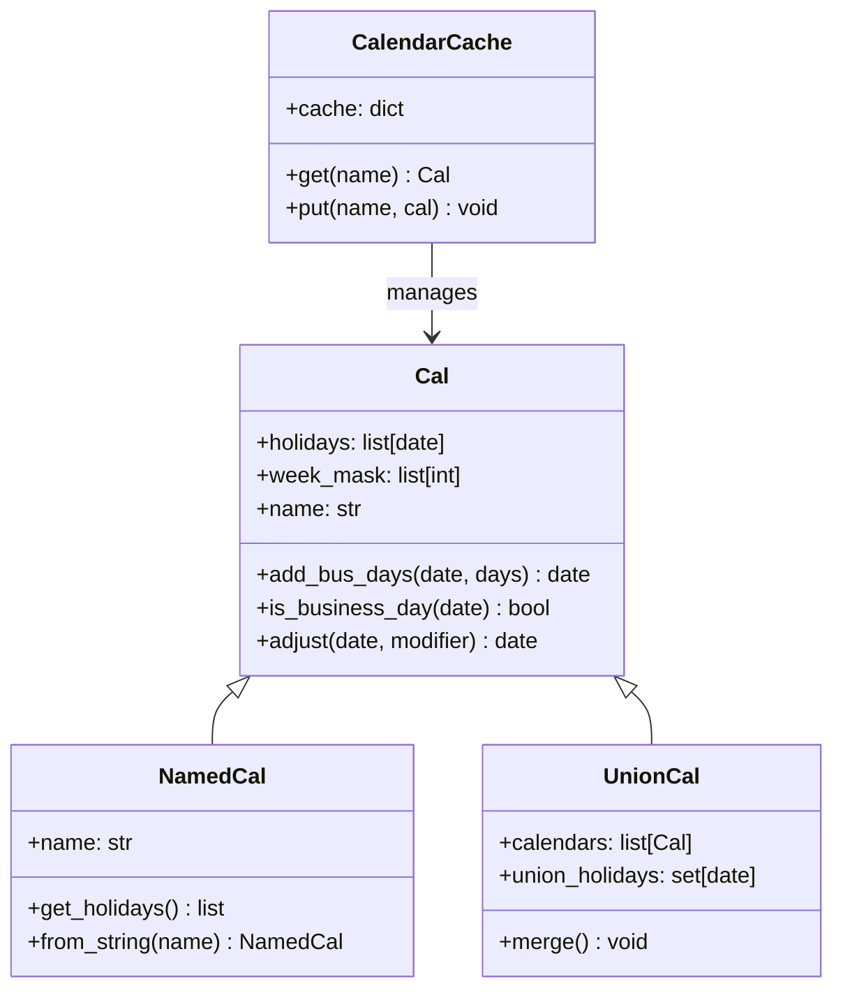
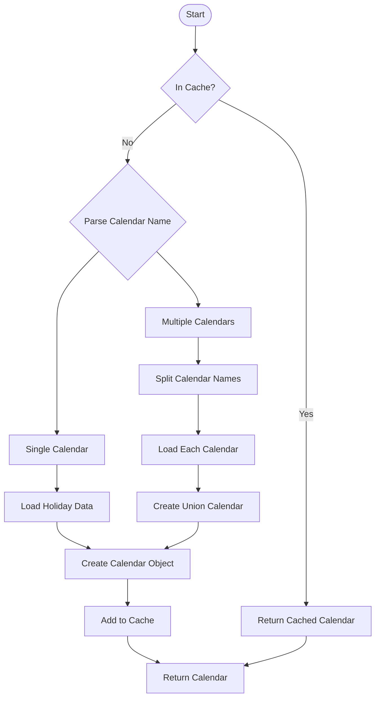
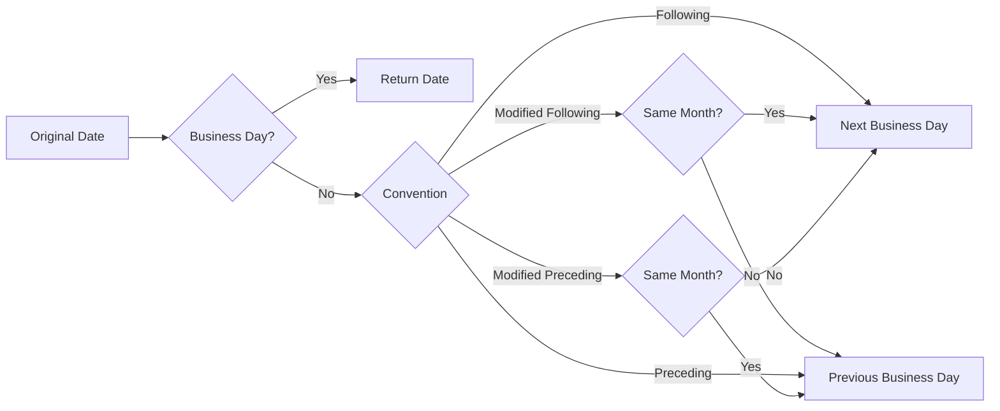

# Calendars.py Documentation

## Overview
Demonstrates financial calendar operations including performance optimization, calendar construction, union operations, and tenor manipulation with settlement calendar features.

## Key Concepts
- **Calendar Types**: Named calendars, custom calendars, union calendars
- **Performance Optimization**: Direct lookup vs construction vs caching
- **Business Day Adjustments**: Following, modified following, preceding conventions
- **Settlement Calendars**: Multi-jurisdictional handling for cross-border transactions

## Script Functionality
The script benchmarks different calendar operations to demonstrate performance characteristics:
1. Direct calendar lookup from hash table
2. Calendar construction from holidays list
3. Named calendar parsing
4. Union calendar construction
5. Cached calendar access optimization

## Command to Run
```bash
cd /home/peter/rateslib/python
python ../scripts/examples/coding_2/Calendars.py
```

## Expected Output
```
Timing: 0.000045  # Direct calendar lookup
Timing: 0.002156  # Calendar construction
Timing: 0.005234  # Named calendar parsing
Timing: 0.001234  # Union calendar creation
Timing: 0.000087  # Cached calendar access
Script completed successfully!
```

## Class Architecture

### Calendar Hierarchy


### Calendar Operations Flow


## Major Financial Centers

### Standard Calendar Codes
| Code | Financial Center | Key Holidays |
|------|-----------------|--------------|
| `nyc` | New York | US Federal holidays, NYSE holidays |
| `ldn` | London | UK bank holidays |
| `tgt` | TARGET (Eurozone) | ECB holidays |
| `tyo` | Tokyo | Japanese national holidays |
| `syd` | Sydney | Australian public holidays |
| `hkg` | Hong Kong | HK public holidays, typhoon days |
| `sgp` | Singapore | Singapore public holidays |
| `fed` | Federal Reserve | FOMC meeting dates |

### Union Calendars
```python
# Common union calendars for cross-border transactions
"ldn,nyc"  # GBP/USD transactions
"tgt,nyc"  # EUR/USD transactions
"tyo,nyc"  # JPY/USD transactions
```

## Performance Characteristics

### Operation Benchmarks
| Operation | Typical Time | Complexity |
|-----------|-------------|------------|
| Direct lookup | ~0.00005s | O(1) |
| Construction | ~0.002s | O(n) holidays |
| Named parsing | ~0.005s | O(m) calendars |
| Union creation | ~0.001s | O(n×m) |
| Cached access | ~0.00009s | O(1) |

### Optimization Strategies
1. **Pre-cache Common Calendars**: Cache frequently used calendars at startup
2. **Use Union Sparingly**: Union calendars are slower than single calendars
3. **Batch Operations**: Process multiple dates together to amortize lookup costs

## Business Day Conventions

### Adjustment Methods


### Convention Selection Logic
- **Following**: Standard for most instruments
- **Modified Following**: Prevents month-end crossing (common for bonds)
- **Preceding**: Used for settlement dates
- **Modified Preceding**: Rare, specific market conventions

## Tenor Operations

### Tenor Addition
```python
# Add tenor to date with calendar adjustment
cal = get_calendar("nyc")
start = dt(2024, 1, 15)
end = cal.add_bus_days(start, 30)  # Add 30 business days

# Common tenor patterns
"1M"  # 1 month (calendar month)
"3M"  # 3 months (quarterly)
"6M"  # 6 months (semi-annual)
"1Y"  # 1 year (annual)
```

### Settlement Calendar Features
```python
# T+2 settlement with different calendars
trade_date = dt(2024, 1, 15)
trade_cal = get_calendar("ldn")
settle_cal = get_calendar("nyc")

# Settlement date calculation
settle_date = settle_cal.add_bus_days(
    trade_cal.adjust(trade_date, "F"), 
    2
)
```

## Integration with Other Modules

### Schedule Generation
```python
from rateslib.scheduling import Schedule

schedule = Schedule(
    effective=dt(2024, 1, 1),
    termination=dt(2025, 1, 1),
    frequency="Q",
    calendar="nyc",  # Uses calendar for adjustments
    modifier="MF"
)
```

### Instrument Pricing
```python
from rateslib import FixedRateBond

bond = FixedRateBond(
    effective=dt(2024, 1, 1),
    termination=dt(2029, 1, 1),
    frequency="S",
    calendar="nyc",  # Settlement calendar
    modifier="MF"
)
```

## Common Patterns and Best Practices

### Pattern 1: Multi-Jurisdiction Settlement
```python
# Cross-border transaction with different calendars
def calculate_settlement(trade_date, trade_cal, settle_cal, days=2):
    # Adjust trade date in trading calendar
    adj_trade = trade_cal.adjust(trade_date, "F")
    # Calculate settlement in settlement calendar
    return settle_cal.add_bus_days(adj_trade, days)
```

### Pattern 2: Holiday Bridge Detection
```python
# Detect extended holiday periods
def find_holiday_bridges(cal, year):
    bridges = []
    for month in range(1, 13):
        # Check each day of month
        for day in range(1, 32):
            try:
                date = dt(year, month, day)
                if not cal.is_business_day(date):
                    # Check if part of extended holiday
                    prev = date - timedelta(days=1)
                    next = date + timedelta(days=1)
                    if not cal.is_business_day(prev) or not cal.is_business_day(next):
                        bridges.append(date)
            except ValueError:
                continue
    return bridges
```

### Pattern 3: Calendar Caching Strategy
```python
# Efficient calendar caching
class CalendarManager:
    def __init__(self):
        self._cache = {}
        self._preload_common()
    
    def _preload_common(self):
        # Pre-cache frequently used calendars
        for cal_name in ["nyc", "ldn", "tgt", "tyo"]:
            self._cache[cal_name] = get_calendar(cal_name)
        # Pre-cache common unions
        for union in ["ldn,nyc", "tgt,nyc"]:
            self._cache[union] = get_calendar(union)
    
    def get(self, name):
        if name not in self._cache:
            self._cache[name] = get_calendar(name)
        return self._cache[name]
```

## Advanced Topics

### Custom Holiday Definitions
```python
# Define custom holidays for specific markets
custom_holidays = [
    dt(2024, 1, 1),   # New Year
    dt(2024, 7, 4),   # Independence Day
    dt(2024, 12, 25), # Christmas
]

custom_cal = Cal(
    holidays=custom_holidays,
    week_mask=[5, 6]  # Saturday=5, Sunday=6
)
```

### Calendar Algebra
```python
# Intersection of calendars (both must be business days)
def calendar_intersection(cal1, cal2, date):
    return cal1.is_business_day(date) and cal2.is_business_day(date)

# Difference of calendars (business day in one but not other)
def calendar_difference(cal1, cal2, date):
    return cal1.is_business_day(date) and not cal2.is_business_day(date)
```

## Debugging and Troubleshooting

### Common Issues
1. **Calendar Not Found**: Check calendar code spelling
2. **Unexpected Adjustments**: Verify modifier convention
3. **Performance Issues**: Check for union calendar overuse
4. **Cache Invalidation**: Clear cache after calendar updates

### Validation Techniques
```python
# Validate calendar consistency
def validate_calendar(cal, year):
    issues = []
    for month in range(1, 13):
        # Check for orphan business days
        # Check for extended closures
        # Validate adjustment consistency
    return issues
```

## Summary
The calendar system in rateslib provides sophisticated handling of business days across multiple financial centers with optimized performance through caching. Understanding the performance characteristics and proper usage patterns is essential for efficient fixed income calculations in multi-jurisdictional contexts.