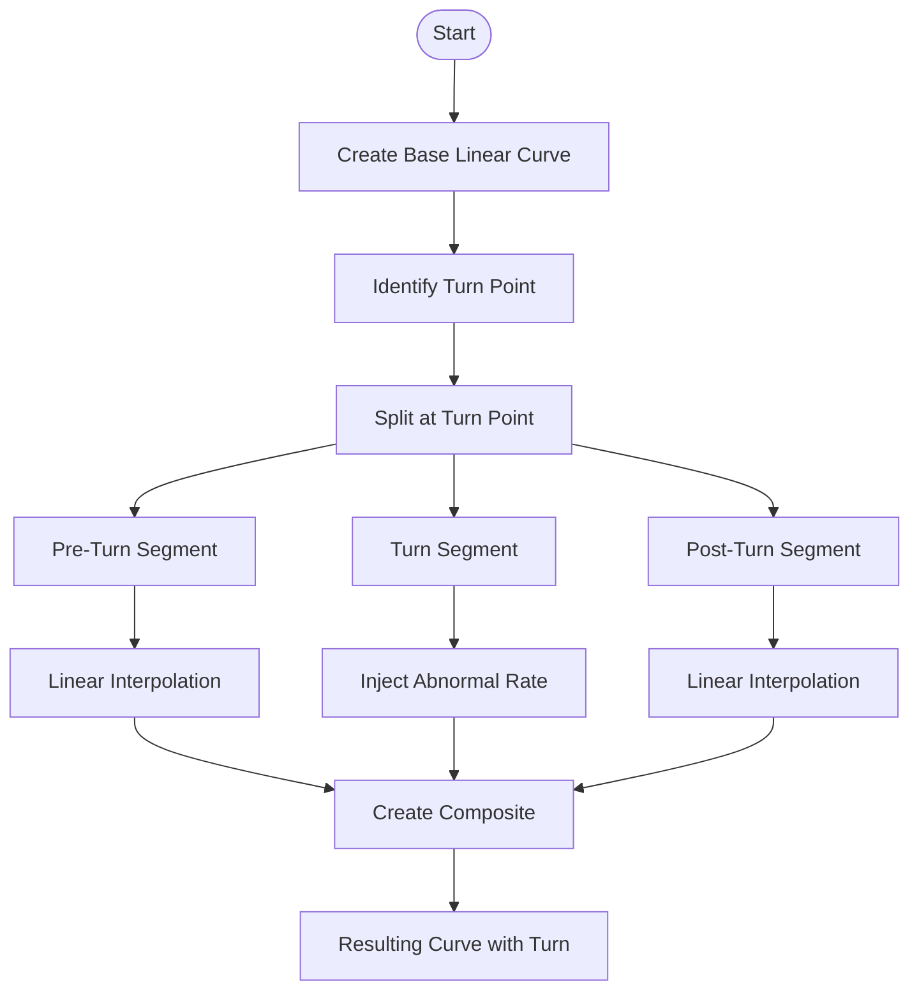
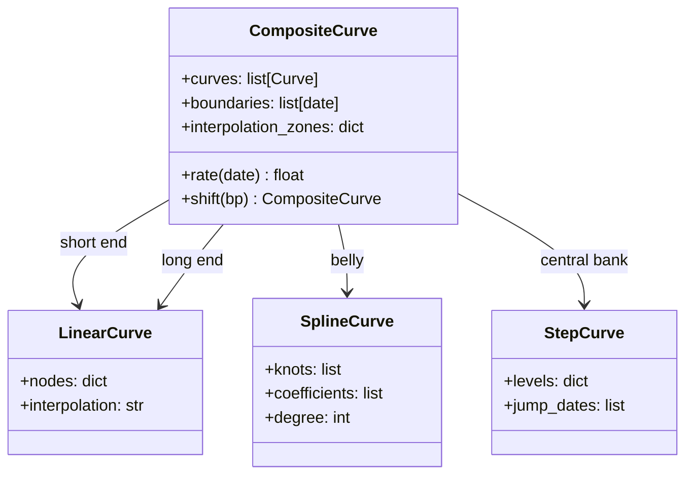
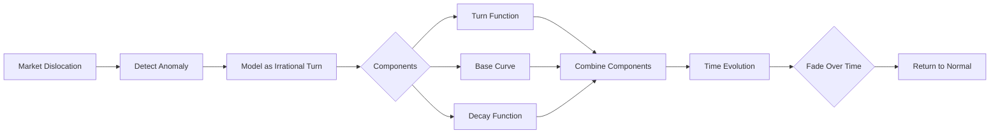
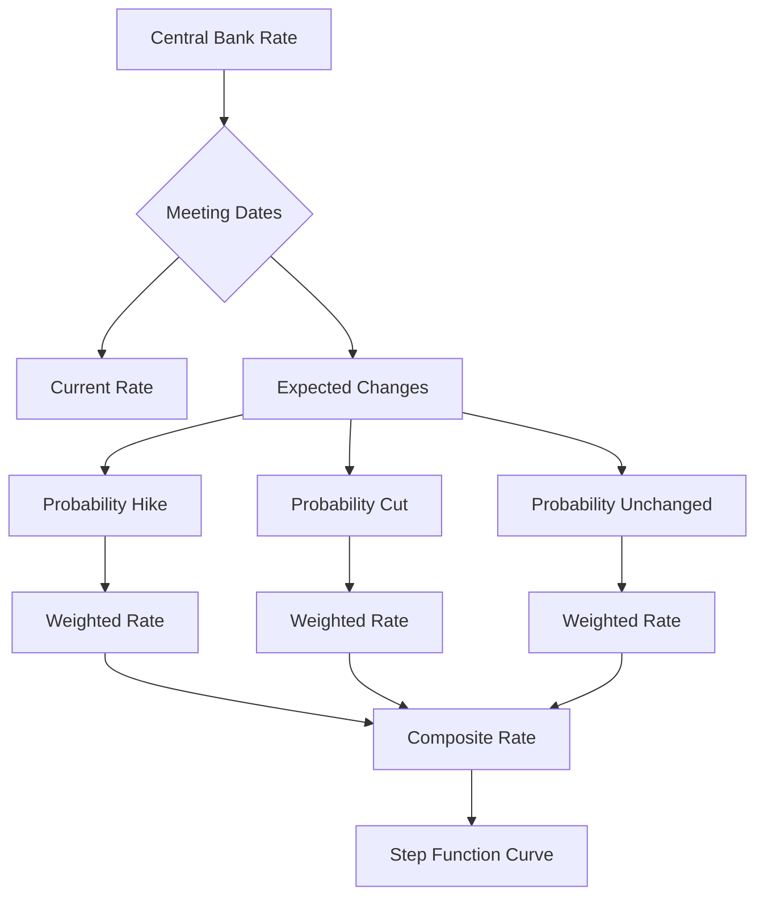
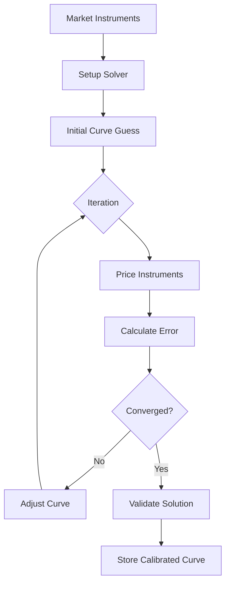

# Cookbook.py Documentation

## Overview
Advanced curve construction cookbook demonstrating sophisticated techniques including "turns" (rapid rate changes), spline curve injection, tenor curve manipulation, and central bank rate modeling. This script showcases real-world fixed income curve building scenarios.

## Key Concepts
- **Turn Injection**: Creating rapid rate changes at specific tenors
- **Composite Curves**: Combining multiple interpolation methods
- **Irrational Turns**: Modeling market dislocations with decay
- **Roll Analysis**: Forward curve evolution for trading strategies
- **Central Bank Modeling**: Step functions for policy rates

## Command to Run
```bash
cd /home/peter/rateslib/python
python ../scripts/examples/coding_2/Cookbook.py
```

## Expected Output
```
Script completed successfully!
```
*Note: Creates multiple plots if matplotlib is available but produces minimal console output*

## Advanced Curve Construction Techniques

### 1. Turn Injection in Linear Curves


### Mathematical Foundation
```python
# Turn injection formula
def inject_turn(curve, tenor, magnitude, width):
    """
    Inject a turn at specific tenor
    
    Rate adjustment:
    Δr(t) = magnitude × exp(-(t - tenor)² / (2 × width²))
    
    Where:
    - magnitude: size of the turn in basis points
    - tenor: location of the turn
    - width: how quickly the turn decays
    """
```

### 2. Composite Curve Architecture


### 3. Irrational Turn Modeling


### Decay Functions
```python
# Exponential decay for irrational turns
def irrational_turn_decay(t, half_life):
    """
    Exponential decay: magnitude(t) = initial × exp(-λt)
    where λ = ln(2) / half_life
    """
    return np.exp(-np.log(2) * t / half_life)

# Mean reversion for temporary dislocations
def mean_reversion_decay(t, reversion_speed):
    """
    Ornstein-Uhlenbeck: dr = -θ(r - r̄)dt
    where θ is reversion speed
    """
    return np.exp(-reversion_speed * t)
```

## Real-World Curve Building Patterns

### Pattern 1: Multi-Segment Yield Curve
```python
def build_multi_segment_curve():
    """
    Typical central bank curve structure:
    - Overnight to 3M: Step function (policy rates)
    - 3M to 2Y: Linear (money market)
    - 2Y to 10Y: Cubic spline (bond market)
    - 10Y to 30Y: Linear extrapolation
    """
    segments = {
        (0, 0.25): StepCurve(policy_rate),
        (0.25, 2): LinearCurve(money_market_nodes),
        (2, 10): SplineCurve(bond_nodes, degree=3),
        (10, 30): LinearCurve(long_end_nodes)
    }
    return CompositeCurve(segments)
```

### Pattern 2: Spread Curve Construction
```python
def build_spread_curve(base_curve, spreads):
    """
    Build credit/basis spread curve on top of base
    
    Total rate = Base rate + Spread
    With proper handling of:
    - Tenor matching
    - Interpolation consistency
    - Spread smoothing
    """
    spread_curve = SplineCurve(spreads, degree=2)
    return CompositeCurve([base_curve, spread_curve])
```

### Pattern 3: Forward Curve Analysis
```python
def analyze_forward_curve(spot_curve):
    """
    Extract forward rates for roll analysis
    
    Forward rate f(t₁, t₂) = [DF(t₁)/DF(t₂) - 1] / (t₂ - t₁)
    
    Key metrics:
    - Carry: Spot - Forward
    - Roll-down: Change in value as time passes
    - Breakeven: Rate change that zeros P&L
    """
    forwards = {}
    for tenor in tenors:
        forwards[tenor] = calculate_forward(spot_curve, tenor)
    return forwards
```

## Central Bank Rate Modeling

### Step Function Implementation


### Meeting Date Modeling
```python
class CentralBankCurve:
    def __init__(self, current_rate, meeting_dates, expectations):
        """
        Model central bank rates with meeting dates
        
        Parameters:
        - current_rate: Current policy rate
        - meeting_dates: List of FOMC/ECB/BoE meeting dates
        - expectations: Market implied probabilities
        """
        self.steps = self._build_steps(
            current_rate, 
            meeting_dates, 
            expectations
        )
    
    def _build_steps(self, rate, dates, probs):
        steps = {dates[0]: rate}
        for i, date in enumerate(dates[1:]):
            # Expected rate = Σ(probability × outcome)
            expected_change = (
                probs[i]['hike'] * 0.25 +
                probs[i]['cut'] * -0.25 +
                probs[i]['unchanged'] * 0
            )
            rate += expected_change
            steps[date] = rate
        return steps
```

## Solver Integration

### Curve Calibration


### Instrument Setup for Calibration
```python
def setup_curve_calibration():
    """
    Setup instruments for curve solving
    """
    instruments = [
        # Money market
        IRS("1W", market_rate=0.025),
        IRS("1M", market_rate=0.028),
        IRS("3M", market_rate=0.031),
        
        # Futures strip
        *[Future(imm_date, price) for imm_date, price in futures],
        
        # Swap curve
        IRS("2Y", market_rate=0.035),
        IRS("5Y", market_rate=0.038),
        IRS("10Y", market_rate=0.041),
        IRS("30Y", market_rate=0.043),
    ]
    
    # Add spread products for turns
    spreads = [
        Spread("2Y", "5Y", market_spread=-3),
        Fly("2Y", "5Y", "10Y", market_fly=2),
    ]
    
    return instruments + spreads
```

## Advanced Topics

### Volatility-Adjusted Curves
```python
def volatility_adjust_curve(base_curve, vol_surface):
    """
    Adjust curve for convexity bias
    
    Adjustment = -0.5 × σ² × T
    
    Where:
    - σ: Volatility from surface
    - T: Time to maturity
    """
    adjusted_nodes = {}
    for tenor, rate in base_curve.nodes.items():
        vol = vol_surface.get_vol(tenor)
        T = calculate_time(tenor)
        adjustment = -0.5 * vol**2 * T
        adjusted_nodes[tenor] = rate + adjustment
    return Curve(adjusted_nodes)
```

### Multi-Currency Curve Sets
```python
class MultiCurrencyCurveSet:
    """
    Manage curves across currencies with basis
    """
    def __init__(self, base_currency="USD"):
        self.base = base_currency
        self.curves = {}
        self.basis_curves = {}
        self.fx_curves = {}
    
    def add_currency(self, ccy, curve, basis=None):
        self.curves[ccy] = curve
        if basis:
            self.basis_curves[f"{ccy}{self.base}"] = basis
    
    def get_discount_curve(self, ccy, collateral_ccy):
        """
        Get appropriate discount curve for collateral
        """
        if ccy == collateral_ccy:
            return self.curves[ccy]
        else:
            # Apply cross-currency basis
            basis = self.basis_curves[f"{ccy}{collateral_ccy}"]
            return self.curves[ccy].shift(basis)
```

## Performance Optimization

### Caching Strategies
```python
class CachedCompositeCurve(CompositeCurve):
    def __init__(self, *args, **kwargs):
        super().__init__(*args, **kwargs)
        self._cache = {}
        self._cache_hits = 0
        self._cache_misses = 0
    
    def rate(self, date, tenor=None):
        key = (date, tenor)
        if key in self._cache:
            self._cache_hits += 1
            return self._cache[key]
        
        self._cache_misses += 1
        result = super().rate(date, tenor)
        self._cache[key] = result
        return result
    
    def cache_stats(self):
        total = self._cache_hits + self._cache_misses
        hit_rate = self._cache_hits / total if total > 0 else 0
        return {
            'hit_rate': hit_rate,
            'cache_size': len(self._cache),
            'memory_mb': sys.getsizeof(self._cache) / 1024 / 1024
        }
```

### Parallel Curve Building
```python
def parallel_curve_build(market_data, currencies):
    """
    Build curves in parallel for multiple currencies
    """
    with ThreadPoolExecutor(max_workers=cpu_count()) as executor:
        futures = {}
        for ccy in currencies:
            future = executor.submit(
                build_single_curve, 
                market_data[ccy]
            )
            futures[ccy] = future
        
        curves = {}
        for ccy, future in futures.items():
            curves[ccy] = future.result()
    
    return curves
```

## Testing and Validation

### Curve Quality Metrics
```python
def validate_curve_quality(curve):
    """
    Check curve quality metrics
    """
    metrics = {
        'smoothness': calculate_smoothness(curve),
        'monotonicity': check_forward_monotonicity(curve),
        'arbitrage_free': check_no_arbitrage(curve),
        'stability': calculate_stability(curve),
    }
    
    issues = []
    if metrics['smoothness'] > 0.001:
        issues.append("Curve not smooth enough")
    if not metrics['monotonicity']:
        issues.append("Forward rates not monotonic")
    if not metrics['arbitrage_free']:
        issues.append("Arbitrage opportunities detected")
    
    return metrics, issues
```

## Summary
The Cookbook script demonstrates advanced curve construction techniques essential for professional fixed income trading and risk management. It showcases how to handle market dislocations, model central bank policy, and build sophisticated multi-segment curves that accurately represent complex market dynamics. The patterns shown are directly applicable to production trading systems and risk management platforms.