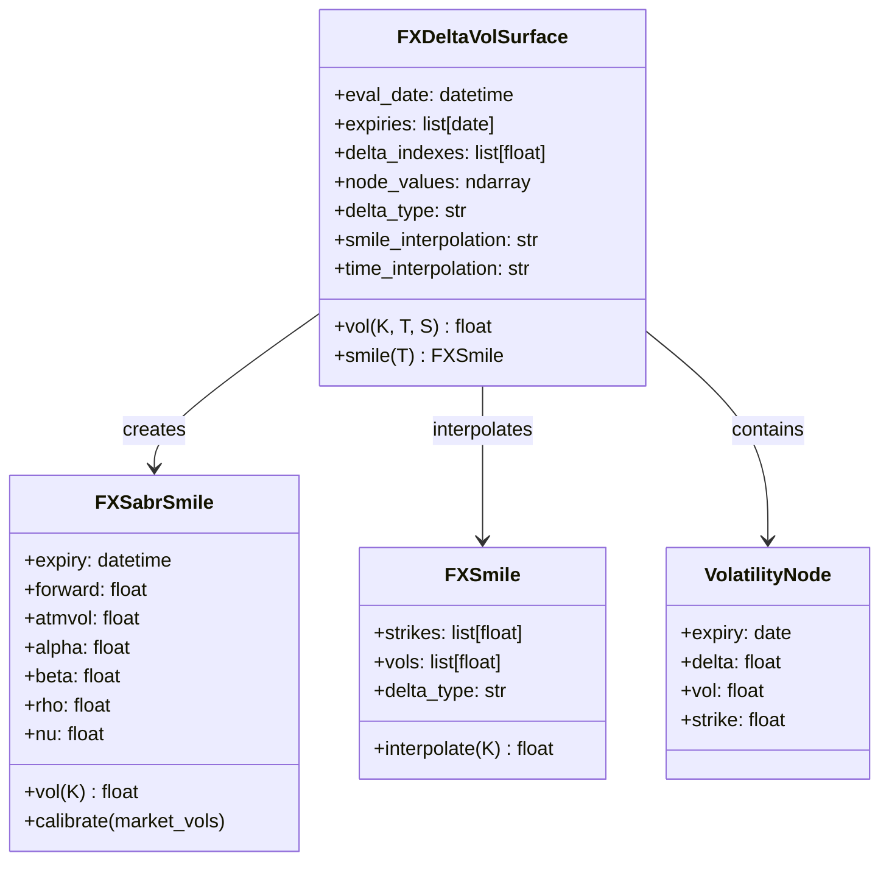
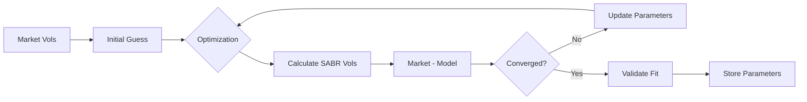
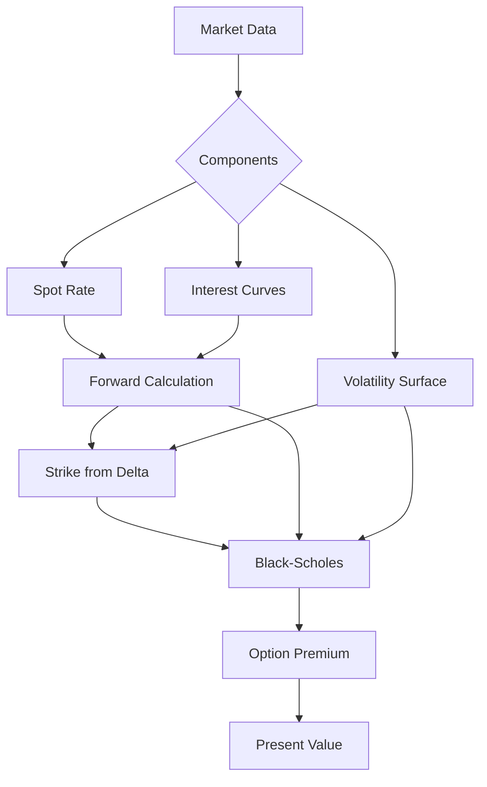
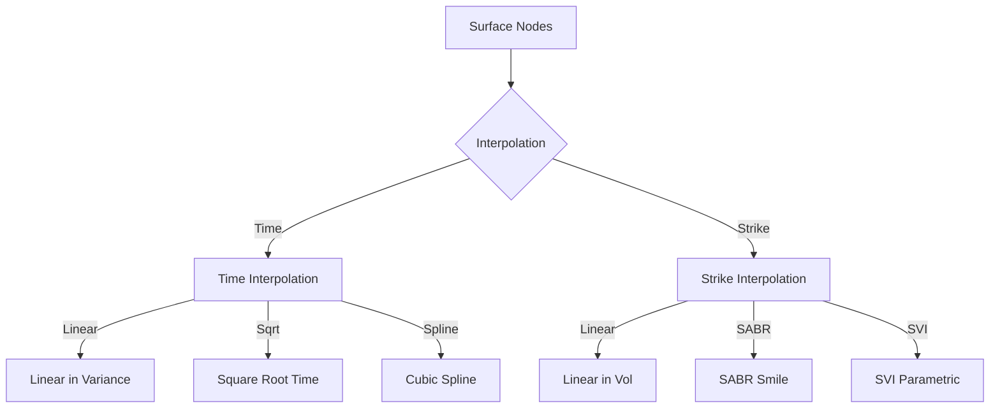

# FXVolatility.py Documentation

## Overview
Demonstrates FX volatility surface construction, option pricing with SABR smiles, and different delta calculation methods (sticky strike vs sticky delta). This script showcases professional FX derivatives pricing and risk management.

## Key Concepts
- **FX Volatility Surfaces**: Delta-based volatility interpolation
- **SABR Model**: Stochastic volatility smile calibration
- **Option Greeks**: Delta, gamma, vega calculations
- **Sticky Strike vs Sticky Delta**: Different delta conventions
- **Smile Dynamics**: How volatility smile moves with spot

## Command to Run
```bash
cd /home/peter/rateslib/python
python ../scripts/examples/coding_2/FXVolatility.py
```

## Expected Output
```
Time weighting display: Pandas Series showing volatility weights
Curve calibration: Interest rate and FX curve solutions
SABR smile calibration: Volatility smile fitted to market
Option Greeks: Delta and gamma calculations
NPV calculations: Present value changes with spot movements
Analytic Greeks comparison: Sticky delta vs regular delta
Script completed successfully!
```

## FX Volatility Surface Architecture

### Surface Structure


### Delta Conventions
```mermaid
flowchart TD
    Quote[Market Quote] --> Convention{Delta Convention}
    
    Convention -->|Spot Delta| SpotDelta[Spot Delta Calculation]
    Convention -->|Forward Delta| FwdDelta[Forward Delta Calculation]
    Convention -->|Premium Adjusted| PADelta[PA Delta Calculation]
    
    SpotDelta --> SpotFormula[Δ = N(d₁)]
    FwdDelta --> FwdFormula[Δ = e^(-rf×T) × N(d₁)]
    PADelta --> PAFormula[Δ = N(d₁) - Premium/Spot]
    
    SpotFormula --> Strike1[Calculate Strike]
    FwdFormula --> Strike2[Calculate Strike]
    PAFormula --> Strike3[Calculate Strike]
```

## SABR Model Implementation

### SABR Dynamics
```
dF = α × F^β × dW₁
dα = ν × α × dW₂
dW₁ × dW₂ = ρ × dt

Where:
- F: Forward rate
- α: Initial volatility
- β: CEV exponent (typically 0.5 for FX)
- ρ: Correlation between forward and volatility
- ν: Volatility of volatility
```

### SABR Calibration Process


### SABR Parameter Interpretation
| Parameter | Typical Range | Interpretation |
|-----------|--------------|----------------|
| α (alpha) | 0.05-0.30 | Base volatility level |
| β (beta) | 0.3-0.7 | Backbone slope (0.5 for FX) |
| ρ (rho) | -0.5-0.5 | Skew parameter |
| ν (nu) | 0.2-1.0 | Smile curvature |

## FX Option Pricing

### Option Valuation Framework


### Black-Scholes for FX Options
```python
def fx_black_scholes(S, K, r_dom, r_for, σ, T, option_type='call'):
    """
    FX Option Pricing
    
    d₁ = [ln(S/K) + (r_dom - r_for + σ²/2)T] / (σ√T)
    d₂ = d₁ - σ√T
    
    Call = S × e^(-r_for×T) × N(d₁) - K × e^(-r_dom×T) × N(d₂)
    Put = K × e^(-r_dom×T) × N(-d₂) - S × e^(-r_for×T) × N(-d₁)
    """
    d1 = (np.log(S/K) + (r_dom - r_for + 0.5*σ**2)*T) / (σ*np.sqrt(T))
    d2 = d1 - σ*np.sqrt(T)
    
    if option_type == 'call':
        return S*np.exp(-r_for*T)*norm.cdf(d1) - K*np.exp(-r_dom*T)*norm.cdf(d2)
    else:
        return K*np.exp(-r_dom*T)*norm.cdf(-d2) - S*np.exp(-r_for*T)*norm.cdf(-d1)
```

## Greeks Calculation

### Delta Types
```mermaid
flowchart TD
    Delta[Delta Calculation] --> Type{Delta Type}
    
    Type -->|Spot| SpotDelta[∂V/∂S]
    Type -->|Forward| FwdDelta[∂V/∂F × ∂F/∂S]
    Type -->|Dual| DualDelta[Automatic Differentiation]
    
    SpotDelta --> Sticky{Sticky Convention}
    FwdDelta --> Sticky
    
    Sticky -->|Sticky Strike| SS[Fixed K, Vol(K)]
    Sticky -->|Sticky Delta| SD[Fixed Δ, Vol(Δ)]
    Sticky -->|Sticky Moneyness| SM[Fixed K/F, Vol(K/F)]
```

### Greeks Formulas
| Greek | Formula | Interpretation |
|-------|---------|----------------|
| Delta | ∂V/∂S | Rate of change vs spot |
| Gamma | ∂²V/∂S² | Convexity of delta |
| Vega | ∂V/∂σ | Sensitivity to volatility |
| Theta | ∂V/∂t | Time decay |
| Rho | ∂V/∂r | Interest rate sensitivity |
| Vanna | ∂²V/∂S∂σ | Delta change with vol |
| Volga | ∂²V/∂σ² | Vega convexity |

### Numerical vs Analytical Greeks
```python
class GreeksCalculator:
    def __init__(self, option, method='analytical'):
        self.option = option
        self.method = method
    
    def delta(self, spot, bump=0.0001):
        if self.method == 'analytical':
            # Analytical formula
            return self.option.analytical_delta(spot)
        elif self.method == 'numerical':
            # Finite difference
            v_up = self.option.price(spot * (1 + bump))
            v_down = self.option.price(spot * (1 - bump))
            return (v_up - v_down) / (2 * spot * bump)
        elif self.method == 'dual':
            # Automatic differentiation
            spot_dual = Dual(spot, ['spot'], [1.0])
            price_dual = self.option.price(spot_dual)
            return price_dual.dual[0]
```

## Volatility Smile Dynamics

### Smile Evolution Models
```mermaid
flowchart LR
    Current[Current Smile] --> Model{Evolution Model}
    
    Model -->|Sticky Strike| SS[σ(K, t)]
    Model -->|Sticky Delta| SD[σ(Δ, t)]
    Model -->|SABR| SABR[σ(K/F, t)]
    Model -->|SVI| SVI[σ(k, t)]
    
    SS --> Future1[Future Smile]
    SD --> Future2[Future Smile]
    SABR --> Future3[Future Smile]
    SVI --> Future4[Future Smile]
```

### Sticky Strike vs Sticky Delta
```python
def smile_evolution(initial_smile, spot_move, convention='sticky_strike'):
    """
    Model how smile evolves with spot movement
    
    Sticky Strike: Volatility stays constant at fixed strikes
    Sticky Delta: Volatility stays constant at fixed deltas
    """
    if convention == 'sticky_strike':
        # Strikes don't change, vols stay same
        new_smile = initial_smile.copy()
    elif convention == 'sticky_delta':
        # Deltas don't change, recalculate strikes
        new_strikes = [
            strike_from_delta(delta, spot_move, vol)
            for delta, vol in initial_smile.items()
        ]
        new_smile = dict(zip(new_strikes, initial_smile.values()))
    
    return new_smile
```

## Risk Management Applications

### Portfolio Greeks Aggregation
```python
class FXOptionPortfolio:
    def __init__(self, positions):
        self.positions = positions  # List of (option, quantity)
    
    def portfolio_greeks(self, spot, vol_surface):
        """
        Aggregate Greeks across portfolio
        """
        total_delta = 0
        total_gamma = 0
        total_vega = 0
        
        for option, qty in self.positions:
            option.update_volatility(vol_surface)
            total_delta += qty * option.delta(spot)
            total_gamma += qty * option.gamma(spot)
            total_vega += qty * option.vega(spot)
        
        return {
            'delta': total_delta,
            'gamma': total_gamma,
            'vega': total_vega,
            'gamma_scaled': total_gamma * spot / 100,  # 1% gamma
        }
```

### Vega Matrix
```python
def calculate_vega_matrix(portfolio, vol_surface):
    """
    Calculate vega sensitivity to each surface node
    
    Returns matrix of:
    - Rows: Expiries
    - Columns: Delta pillars
    - Values: Vega amounts
    """
    expiries = vol_surface.expiries
    deltas = vol_surface.delta_indexes
    
    vega_matrix = np.zeros((len(expiries), len(deltas)))
    
    for i, expiry in enumerate(expiries):
        for j, delta in enumerate(deltas):
            # Bump this specific node
            bumped_surface = vol_surface.bump_node(expiry, delta, 0.01)
            
            # Recalculate portfolio value
            base_value = portfolio.npv(vol_surface)
            bumped_value = portfolio.npv(bumped_surface)
            
            # Vega for this node
            vega_matrix[i, j] = bumped_value - base_value
    
    return pd.DataFrame(vega_matrix, index=expiries, columns=deltas)
```

## Market Data Structures

### Volatility Surface Quotes
```python
# Standard market quotes structure
market_quotes = {
    '1W': {'25P': 8.5, 'ATM': 7.2, '25C': 8.3},
    '1M': {'25P': 9.1, 'ATM': 8.0, '25C': 8.8},
    '3M': {'25P': 9.5, 'ATM': 8.5, '25C': 9.2},
    '6M': {'25P': 9.8, 'ATM': 8.8, '25C': 9.4},
    '1Y': {'25P': 10.1, 'ATM': 9.2, '25C': 9.7},
}

# Risk reversal and butterfly quotes
rr_bf_quotes = {
    '1M': {'RR': -0.3, 'BF': 0.15},  # 25D RR and BF
    '3M': {'RR': -0.3, 'BF': 0.20},
    '6M': {'RR': -0.4, 'BF': 0.25},
    '1Y': {'RR': -0.5, 'BF': 0.30},
}
```

### Surface Interpolation Methods


## Calibration Strategies

### Multi-Instrument Calibration
```python
class SurfaceCalibrator:
    def __init__(self, market_data):
        self.market_data = market_data
        self.surface = FXDeltaVolSurface()
    
    def calibrate(self):
        """
        Calibrate to multiple instrument types
        """
        # Step 1: Calibrate to ATM vols
        self._calibrate_atm()
        
        # Step 2: Calibrate to RR/BF
        self._calibrate_smile()
        
        # Step 3: Validate with vanillas
        self._validate_vanillas()
        
        # Step 4: Check arbitrage constraints
        self._check_arbitrage()
    
    def _check_arbitrage(self):
        """
        Ensure no calendar or butterfly arbitrage
        """
        # Calendar spread arbitrage
        for i in range(len(self.surface.expiries) - 1):
            t1 = self.surface.expiries[i]
            t2 = self.surface.expiries[i + 1]
            
            # Total variance must be increasing
            var1 = self.surface.atm_vol(t1)**2 * t1
            var2 = self.surface.atm_vol(t2)**2 * t2
            
            assert var2 > var1, f"Calendar arbitrage at {t1}, {t2}"
```

## Advanced Topics

### Local Volatility Surface
```python
def dupire_local_vol(S, K, T, r_dom, r_for, implied_vol_surface):
    """
    Calculate local volatility using Dupire formula
    
    σ_local² = (∂C/∂T + (r_d - r_f)K∂C/∂K + r_f C) / (0.5 K² ∂²C/∂K²)
    """
    # Get implied vol and derivatives
    σ = implied_vol_surface.vol(K, T)
    ∂σ_∂T = implied_vol_surface.vol_time_derivative(K, T)
    ∂σ_∂K = implied_vol_surface.vol_strike_derivative(K, T)
    ∂²σ_∂K² = implied_vol_surface.vol_strike_second_derivative(K, T)
    
    # Convert to call price derivatives
    C = fx_black_scholes(S, K, r_dom, r_for, σ, T, 'call')
    
    # ... implement Dupire formula
    
    return local_vol
```

### Variance Swaps
```python
def variance_swap_strike(vol_surface, expiry):
    """
    Calculate fair variance swap strike
    
    K_var = E[Realized Variance] = ∫ σ²(K) × pdf(K) dK
    
    Using replication:
    K_var = 2/T × [∫₀^F P(K)/K² dK + ∫_F^∞ C(K)/K² dK]
    """
    F = vol_surface.forward(expiry)
    
    # Discretize strike space
    strikes = np.linspace(0.5*F, 2*F, 100)
    
    variance = 0
    for i in range(len(strikes)-1):
        K = strikes[i]
        dK = strikes[i+1] - strikes[i]
        
        if K < F:
            # Put wing
            option_value = fx_black_scholes(F, K, 0, 0, 
                                           vol_surface.vol(K, expiry), 
                                           expiry, 'put')
        else:
            # Call wing
            option_value = fx_black_scholes(F, K, 0, 0,
                                           vol_surface.vol(K, expiry),
                                           expiry, 'call')
        
        variance += 2 * option_value / K**2 * dK
    
    return variance / expiry
```

## Performance Optimization

### Surface Caching
```python
class CachedVolSurface(FXDeltaVolSurface):
    def __init__(self, *args, **kwargs):
        super().__init__(*args, **kwargs)
        self._vol_cache = {}
        self._smile_cache = {}
    
    def vol(self, K, T, S=None):
        cache_key = (K, T, S)
        if cache_key in self._vol_cache:
            return self._vol_cache[cache_key]
        
        vol = super().vol(K, T, S)
        self._vol_cache[cache_key] = vol
        return vol
    
    def clear_cache(self):
        self._vol_cache.clear()
        self._smile_cache.clear()
```

## Summary
The FXVolatility script demonstrates professional-grade FX derivatives pricing with sophisticated volatility surface modeling, SABR calibration, and comprehensive Greeks calculation. It showcases the integration of market data, numerical methods, and risk management tools essential for FX options trading and portfolio management.